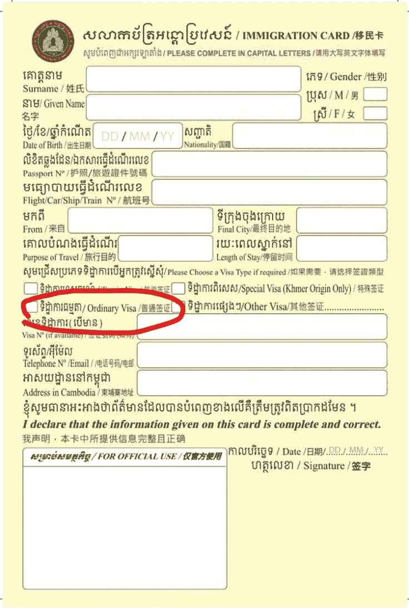
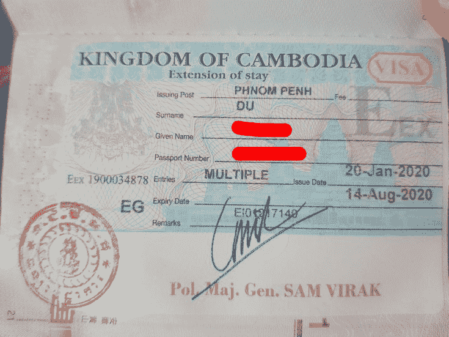

# 如何轻松获得6个月多次往返的柬埔寨签证

> 原文：[https://piaohanshenghuo.com/cambodia-eg-visa/](https://piaohanshenghuo.com/cambodia-eg-visa/)

获得6个月多次往返的柬埔寨签证其实很简单，不需要提前申请，只需要在入境的时候在**移民卡（****Immigration card****）**上选择**普通签证**就可以了。

普通签证（E VISA）需要35美元，只能待30天，显然这还不够，你还需要找一家签证的中介申请一个EG VISA（找工作的的签证），这个签证最多可以申请到6个月（也可以申请3个月），签证费我当时花了184美元。

注意，**必须得找签证中介**，我当初还以为自己就可以申请，自己骑摩托大老远跑到金边机场对面的移民局，结果工作人员告诉我必须得通过中介申请……

中介公司有不少，我当初用的是”EMC Cambodia Visa Extension Agency”（谷歌地图上就能找到）。

大概一周之后签证就能办好了，中介公司会给你发短信。

这个签证的好处是你不需要真的去找任何工作，可以在柬埔寨待6个月，在这6个月内可以随意往返柬埔寨，还**可以开通柬埔寨的银行卡**。总费用：219美元（35+184）。

**熬夜码字不易，欢迎以打赏、分享、转发、点页面右下角的“在看”和“点赞”等方式以示支持。**

**另外，还可以点击公众号文章底部的广告来支持我（每个成功的点击量可以帮我赚几毛钱）**。

**谢谢！**

剽悍生活UL(微信公众号)分享关于**两性关系**、**自我提升**、**数字游民的生活方式**的原创内容，帮你过上更理想的生活（尤其是性生活）。

剽悍生活的个人微信号：ycf3721，[一对一视频教学](https://piaohanshenghuo.com/1on1_coaching/)，或拉你进入[剽悍生活泡妞讨论群](https://piaohanshenghuo.com/ul-wechat-group/)，请注明加我的目的。

* * *