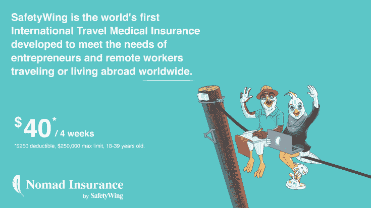
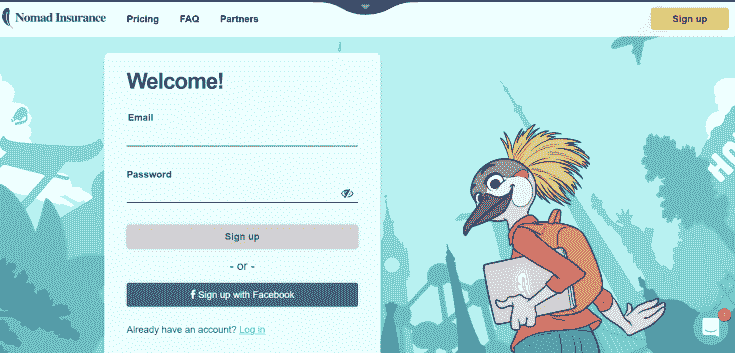
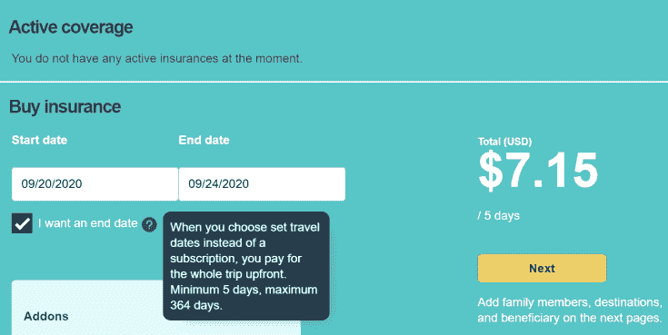
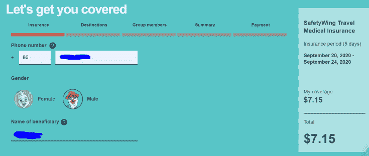
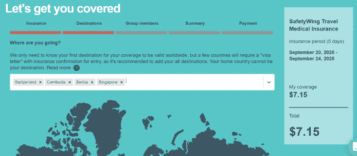
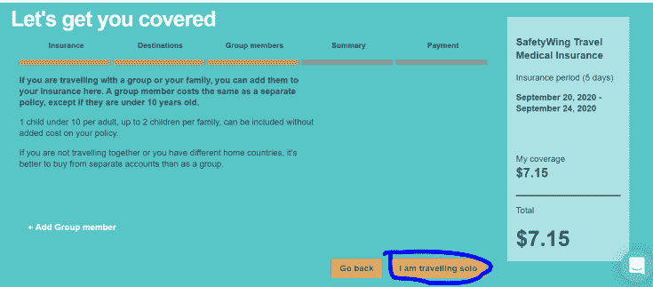
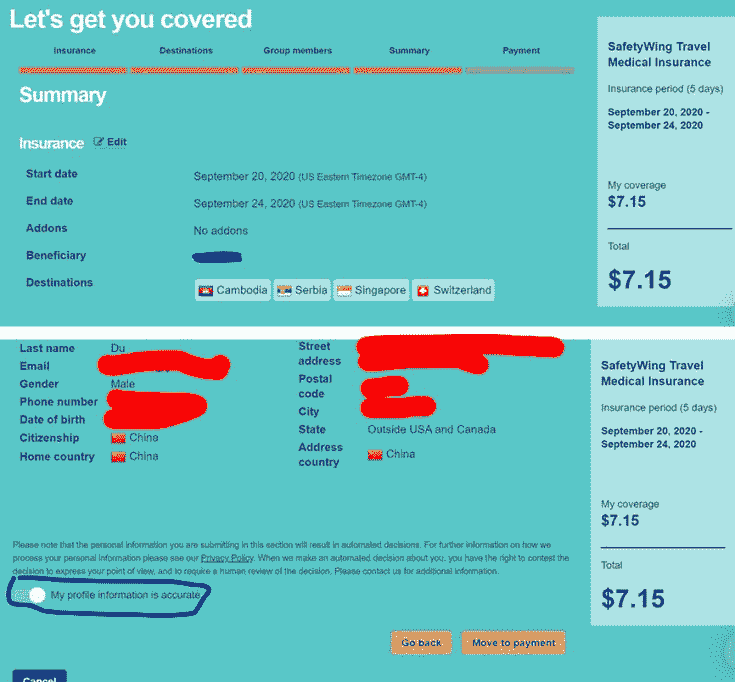
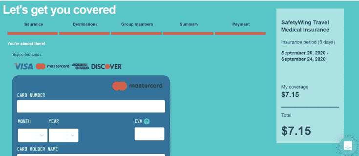
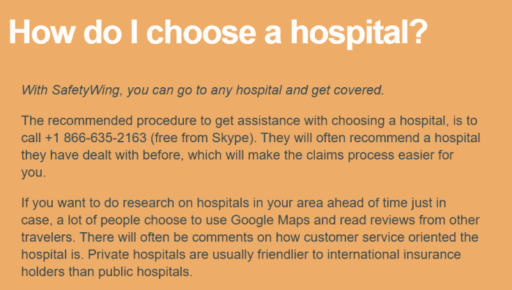

# 我用过的最灵活的可以保新冠病毒的国际旅行保险

> 原文：[https://piaohanshenghuo.com/best-travel-insurance/](https://piaohanshenghuo.com/best-travel-insurance/)

我要离开呆腻了的柬埔寨，去塞尔维亚，突然意识到我的保险早就过期了，是时候买个保险了。

我之前去泰国之前是在淘宝上买的旅行险，幸运的我从来没有必要申报任何赔偿。我发现**国内的国际旅行保险都得人在国内才能买，而且还不保新冠肺炎**。

在做了一系列调查后，我发现了一款非常优秀、灵活、方便的保险“**Safety Wing****（****[点此去官网](https://safetywing.com/nomad-insurance?referenceID=getsafetywing)****）**”，Safety Wing是著名的创业孵化器Y Combinator支持的产品，后台很结实，靠谱。

特定是：

*   **非常灵活**（可以自由选择7天到364天的保期）。
*   可以基本**保全世界任何国家**（180个国家，只有像朝鲜、伊朗之类的国家不保，估计你也不会去这些国家）。
*   **价格相对同类产品很划算**：标准的4周的保费是40美元，我看了一下类似的另一个产品”World Nomad”，4周要28美元！贵了3倍！
*   **可以在任何国家购买**。
*   还可以给一群人一起保。
*   有全天候的在线客服（网页右下角就有）。
*   保的东西很全，不但**包含新冠病毒**的医疗险，还包含航班延误之类的旅行险。

特别适合像我这样的数字游民（digital nomad）。

具体的购买方式也很简单，具体做法如下：

**[先去Safety Wing的官网](https://safetywing.com/nomad-insurance?referenceID=getsafetywing)**，并点击右上角的“Sign up”来注册账号，可以用邮箱，也可以直接用Facebook的账号登录。在注册好账号之后，点击首页的“Buy Now”按钮就可以了。

第一步：选择保险日期（如下图），默认是没有截止日期的，这样是每4周收你40美元，直到364天后。像我的话，我选择了一个截止日期，只订了5天，只需要7.15美元。选好之后就可以点“Next”（下一步）了。

第二步：填你的手机号（中国手机号在第一格的“+”后输入”86，再在第二格输入你的11位手机号），选择性别，再选择投保的受益人（万一你挂了的话）。

第三步：选择你的目的地（不包含伊朗、朝鲜、古巴、叙利亚），有的国家需要有保险才能进入，所以才有这一步的必要。

第四步：可以添加一起旅行的人，可以免费添加一个10岁下的小孩儿。像我这样只给自己买的话选择“I am travelling solo”（我独自旅行）就可以了。

第五步：核对一下你的信息，确认无误之后选择“My Profile information is accurate”，再点”Move to payment”就可以付款了。

第六步：付款，支持国际最常用的VISA和MASTER卡。

付款成功后就购买成功了，你会自动收到关于本次投保详情的电子邮件。

万一发生意外，申报保险也非常简单，官网上都有详细的步骤**。**

**理论上你是可以去任何医院，这个保险都是保的**，但是他们建议你打电话问，他们可以给你推荐他们之前打过交道的医院，这样会更方便，返回保费的过程会更快。电话号码：+1 866-635-2163（在Skype上可以免费打这个电话）。

基本就写到这里了，[官网上有更详细的介绍](https://safetywing.com/nomad-insurance?referenceID=getsafetywing)，希望能帮到​需要帮助的人。

敬请期待下一篇文章，**熬夜码字不易，别忘了通过点赞、分享、打赏等方法鼓励我更快地发表下一篇文章**。

**另外，还可以点击公众号文章底部的广告来支持我（每个成功的点击量可以帮我赚几毛钱）**。

**谢谢！**

* * *

剽悍生活UL(微信公众号)分享关于两性关系、自我提升、数字游民的生活方式的原创内容，帮你过上更理想的生活（尤其是性生活）。

剽悍生活的个人微信号：ycf3721，[一对一视频教学](https://piaohanshenghuo.com/1on1_coaching/)，或拉你进入[剽悍生活泡妞讨论群](https://piaohanshenghuo.com/ul-group-chat/)，请注明加我的目的。

