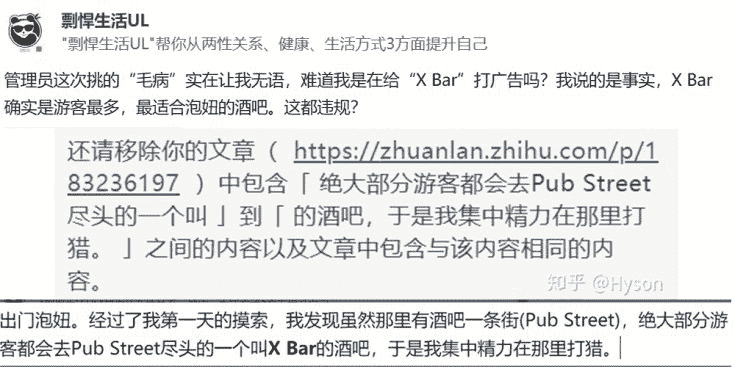
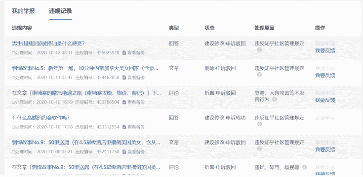
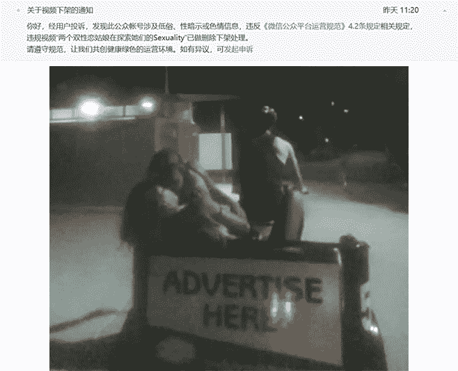
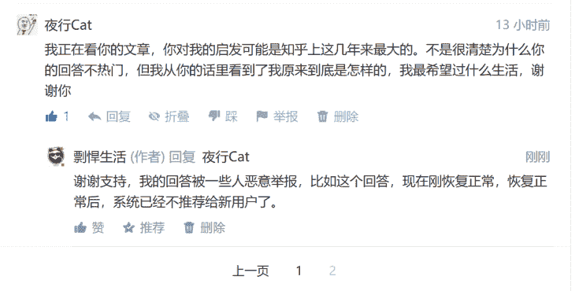

# 如何更快地免费看到新的剽悍生活的原创内容（剽悍生活读者必读）

> 原文：[https://piaohanshenghuo.com/how-to-support-ul/](https://piaohanshenghuo.com/how-to-support-ul/)

<audio src="https://piaohanshenghuo.com/wp-content/uploads/2020/10/Big-Daddy-Kane-Aint-No-Half-Steppin-Lyrics.mp3" controls="controls"></audio>

（背景音乐）

各位剽悍生活的读者们大家好，非常感谢各位的关注和支持。**没有你们，我是不会坚持创作内容的**。国内的网络环境对于我这种真实又思想开放的原创作者来说实在太艰难了。

**具体如何免费支持剽悍生活、看更多剽悍生活的原创内容请看文末**，我先写点儿剽悍生活的历史。

剽悍生活博客/公众号大概开始于2年多以前，刚开始我大概每周会写一两篇文章，完全不知道如何推广我的内容，只是加了一些群，在群里分享我的公众号的内容。后来我开始在知乎上回答问题，记得最初的几篇很火的回答是“[为什么现在越来越多的男人不想结婚了？](https://www.zhihu.com/question/276648130/answer/625989106)”和“[有一个外国女友是种怎样的体验？](https://www.zhihu.com/question/27428976/answer/656470117)“，获得了很多赞同，同时也不出意料地获得了很多反对、骂声，这对我倒无所谓，在我意料之中，我不在乎。可惜这两个“很火”的回答也火得非常短暂，**很快就被恶意举报得被建议修改了，修改好之后流量就少得可怜了**。

**写的东西有人看往往是作者最大的动力，当年乔布斯的苹果电脑如果没受欢迎，很可能就没有心思、动力、经费去研究苹果手机之类的经典产品了**。

后来我的公众号和知乎一直不温不火，我继续按部就班地“缓慢”更新，有时即使不发文章也会发一些有趣的、涨姿势的图片，直到去年年末，我的公众号莫名被封了，我非常无奈、气愤又寒心。但是介于很多剽悍生活读者的支持和鼓励，我又重新注册了现在的新的公众号“剽悍生活UL”，**复制粘贴了所有旧文章并阉割了部分“敏感内容”之后就很少更新了。因为我对国内的网络环境实在太失望了，像我这样的原创作者好不容易写的东西让小人恶意举报后说删就删了，甚至还把整个号给封了**。

今年第一季度我基本就没更新过，后来才开始慢慢更新，大概2周会更新一篇文章，后来一天晚上睡觉之前我复制粘贴了早已经在公众号和官网上发表过了的《剽悍故事No.9》在知乎上，结果一觉醒来之后那篇文章收获了100多个赞，我多了800多个关注者。我非常欣喜，心想：照这个势头我一天能涨2000个关注者！**结果好景不长，****2****个小时内文章就被恶意举报成功、建议修改了。等我修改好、通过审核之后已经过了一整天，文章本来的高流量也消失了**。

时过一两个月后，《剽悍故事No.9》这篇文章又被知乎的算法捡起来了，流量又慢慢涨起来了，然而又不出意料地被恶意举报成功了……就这样目前**这篇文章已经被反复恶意举报成功****5****次了**，**这说明每次我按照之前管理员的要求修改好的“符合知乎规范的文章”都会被新的管理员找到新的违规的地方，相当于每个新的管理员都在抽旧的管理员的嘴巴**。

这件事让我又惊喜又气愤，惊喜是因为知乎确实能给我带来很大的流量，而且**确实有很多人喜欢我的内容**，气愤显然是因为**国内的网络环境导致了像知乎这样的平台只要有小人使劲恶意举报，早晚都会有不喜欢我的内容的管理员判我的文章违规**。

让我哭笑不得的各种无理取闹的违规判定层出不穷。可以看下图，居然可以这样耍流氓，我推荐去一个叫“X Bar”的酒吧泡妞，这都被判为违规了，X Bar又不是我开的，实在让人无语……

我真的没法理解这些不断恶意举报的人，因为我本人的话，如果我不喜欢某个人的内容，我不关注就好了，我只关注我喜欢的人。比如我在写[我学英语的心得](https://piaohanshenghuo.com/how_to_learn_english/)时就推荐了很多我喜欢的Youtube频道。这些人可好，浪费自己有限的时间在恶意举报自己不喜欢的内容上。

我并没有妥协和气馁，而是在最近更加活跃地进行创作，知乎流量有时也涨了不少，**但是每次流量上涨都会被恶意举报成功**，流量直接归0，每天都在坐”流量的过山车”，提心吊胆。

大家可以看下方的截图，我基本每天都会被恶意举报成功……

最近微信公众号居然也被小人举报成功了，我分享的两个姑娘在三轮车上接吻的视频被判定为“色情低俗”。

吐槽到处为止（[我在知乎的“想法”上](https://www.zhihu.com/people/piao-han-sheng-huo-36/pins)有更多的吐槽内容，感兴趣的可以去看）。

**我今后无论是在微信上还是在知乎上都会尽量“和谐“一点，把原汁原味的内容都放在剽悍生活的官方博客上**。

总之，希望大家意识到：**让剽悍生活的内容被更多人看到、产生更多积极的影响是我坚持创作最大的动力**，**流量、读者越多，我创作得也会越频繁，我有太多东西想写，但是没空写**。

**我目前并没有靠剽悍生活为主要的经济来源，但我希望未来可以做到，因为能帮助到志同道合的人对我来说非常有成就感，也能给我带来很大的快乐**。

大家也能看到，我并没有像大部分自媒体一样想方设法在用户身上捞钱，我目前只推出了[很实惠的、永久的、靠谱的付费微信讨论群](https://piaohanshenghuo.com/ul-group-chat/) ，[高质量的一对一的视频咨询服务](https://piaohanshenghuo.com/1on1_coaching/)，[人数最多的QQ讨论群](https://piaohanshenghuo.com/ul-qq-group/)，以及[内容和可以沉淀的论坛（剽悍星球）](https://piaohanshenghuo.com/ul-planet/)，**我有考虑在未来关注者足够多之后写书或推出课程（一定会保证质量）**。

为了能让剽悍生活成为我未来的主要经济来源，我需要足够多的关注者，这意味着我需要让我的内容被更多的人看到，**帮我让我的内容被更多的人看到就得靠各位剽悍生活的读者的帮助了**。

**大家可以免费帮助到我的方式有**：**分享我的内容给志同道合的朋友**，**在知乎、公众号的文章和回答下点赞**（**知乎必须得“正常阅读”后点赞才有效**，**如果花一秒直接到文末点个赞同是没用的，所以麻烦大家平时阅读的同时养成随手点赞的习惯）**。

**点赞是非常有帮助的，尤其是知乎上等级、权重高的账号的点赞。因为知乎的算法很看重点赞，点赞率高的内容才有机会被推荐给更多的人看，更多的人看，意味着我有更多的动力进行创作，大家也能免费看到我新的作品，吸取更多的价值，我们双赢，这样才能形成正向循环。**

这是我暂时能想到的对抗恶意举报的最好的办法**。**

基本就是这样**，谢谢大家的支持[抱拳]。**

* * *

剽悍生活UL(微信公众号)分享关于**两性关系**、**自我提升**、**数字游民的生活方式**的原创内容，帮你过上更理想的生活（尤其是性生活）。

剽悍生活的个人微信号：ycf3721，[一对一视频教学](https://piaohanshenghuo.com/1on1_coaching/)，或拉你进入[剽悍生活泡妞讨论群](https://piaohanshenghuo.com/ul-wechat-group/)，请注明加我的目的。

