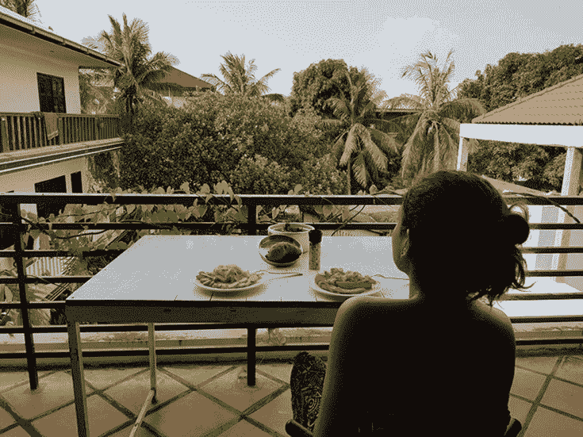
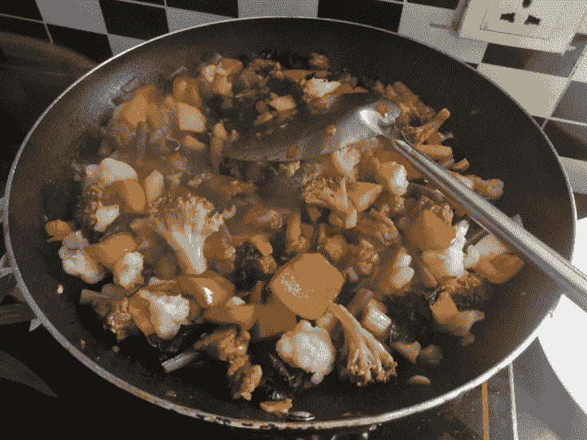
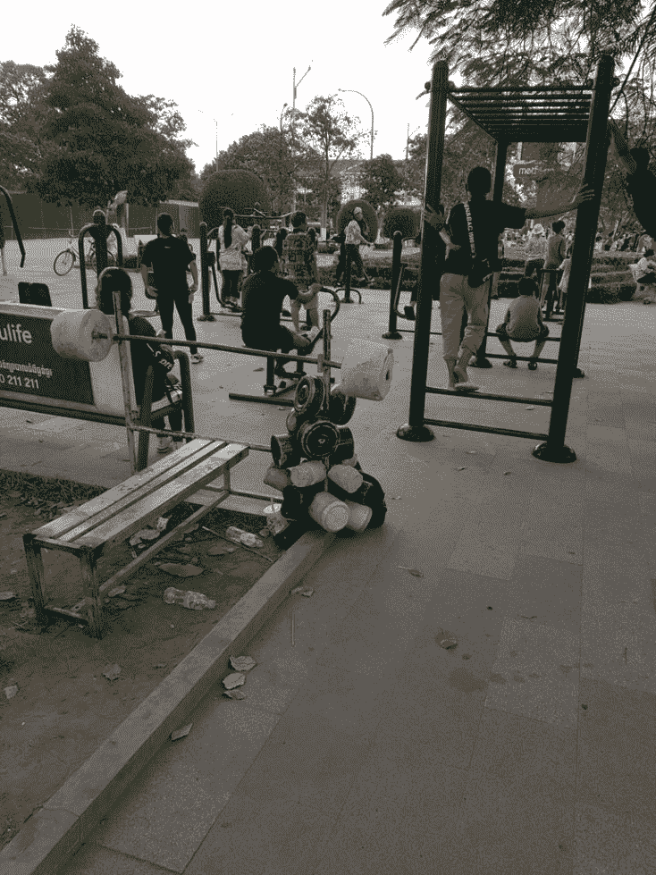
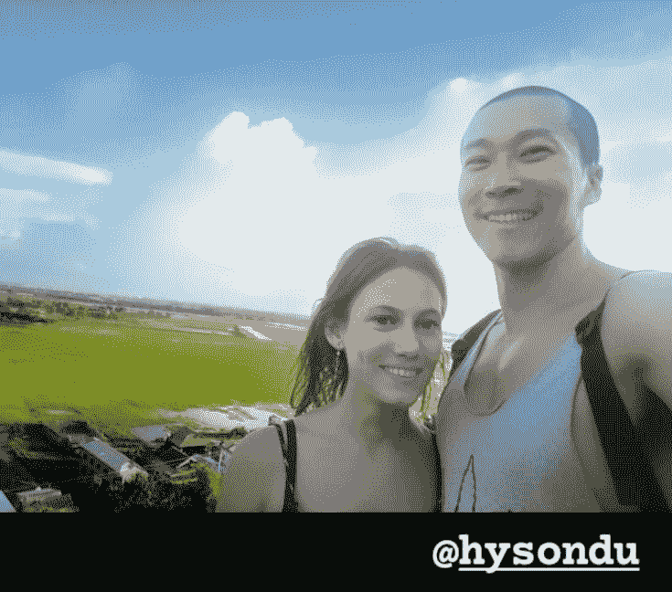

# 柬埔寨暹粒（Siem Reap）生活攻略（租房、物价、景点、泡妞地点等）

> 原文：[https://piaohanshenghuo.com/siem-reap-guide/](https://piaohanshenghuo.com/siem-reap-guide/)

一眨眼，我已经被困在柬埔寨大半年了，我选择被困在暹粒，因为暹粒是我认为柬埔寨最适合居住的地方，而且价格比金边便宜不少，又没有金边的交通拥堵和污染。如果海边对你很重要的话，推荐你去Kampot或Kep。

先晒一下我的生活费：4月份的总支出大概是920美元，5月份770美元，6月份521美元，7月份608美元，8月份927美元（包括207美元修手机的钱）。

其中前三个月我都在和一个哥伦比亚的姑娘同居，并支付了大部分生活费（我们基本都是自己在家做饭吃，她出力做饭，我出钱买菜）。

我感觉一个人的话，安顿下来之后，500美金一个月是足够生活的（如果你只付房租和食物的话），还是很便宜的。

我的支出大部分都是房租和食物。

房租一个月200美元，可以租到一个五脏俱全的有厨房的房间，我刚开始租的地方还有个泳池。电费是0.25美元一度，不用空调的话一个月大概要20美元（第一个月很热，我们每天睡觉的时候用空调，结果一个月花了70多美金）。

**寻找住宿最简单的办法是上Facebook搜索”Siem Reap”的群**，有很多群都有租房信息，可以直接用Facebook Messenger和出租房子的人沟通，很方便。

强烈推荐我的房东（Facebook搜”Kimlot Keo”），她有两栋房，我住在其中一栋，非常完美。厨房、洗衣机、风扇、空调、纱窗（防蚊必备）等一应俱全，网络相对比较稳定（柬埔寨很多地方网络都不好），在安静的小巷里，位置也很靠近中心。平时要250刀一个月，疫情期间只要200刀。我当时因为原来住的地方没有纱窗，雨季蚊子多，所以才在Facebook group上边找到她的广告，我原来的住处还有10天才到期，我告诉她我10天后才入住，她说我随时可以入住，10天后才开始算我的住宿时间，人实在是太好了！

**食物是最大的支出**，柬埔寨的食物很贵（相对于柬埔寨人的平均收入（我在公园健身时认识的一个柬埔寨的小伙儿，他在一个还不错的旅馆当夜间的前台，一个月只有200美元的工资）），是在我去过的东南亚国家中最贵的。

我在暹粒最喜欢的餐厅叫“**My Little Cafe**”，物美价廉，干净卫生，味道还很好，服务员态度好，说英文。我最喜欢的几道菜有: Grilled Fish with Green Mango(3.5美元),Fresh Spring Rolls(1.5美元),Spicy Butter Chicken(3美元)，和朋友一起去的话还可以吃他们的烧烤，我在这里吃了好几个月，直到我后来住进了一个有厨房的公寓。

另外当地的“饿了么”叫”**Food Panda**”（和泰国一样），外卖也很方便。

不过我基本都是自己做饭，其实这样暂用的时间成本更贵，但是这样最健康，而且给了我更多离开电脑放松的时间。我在当地菜市场买大部分蔬菜（菜市场最便宜），再去唯一的大超市**Makro**（最便宜的、最大的超市）买肉（菜市场的肉都直接摆在外边招苍蝇，不敢买）。

列举一下我常买的能记住价格的食物：

当地菜市场（谷歌地图上搜“**Phsar Samaki Vgetable & Fruit Market**”）：

地瓜：0.75美元/公斤

西蓝花：2.25美元/公斤

菜花：2美元/公斤

牛油果：3美元/公斤

煮玉米：0.25美元/个

大蒜：3美元/公斤

洋葱：0.75美元/公斤

百香果：0.75美元/公斤

茄子：0.5美元/公斤

黄瓜：0.75美元/公斤

青椒：3美元/公斤

石榴：2.5美元/公斤

小西瓜：大概0.5美元一个

Makro超市：

鸡蛋：3.25美元/30个

鸡胸脯：3~4美元/公斤

牛肉（我最喜欢的是Makro卖的”Beef Round”）：10美元/公斤

三文鱼（带皮的部分，同样很有营养）：5美元/公斤，如果只买最好的橙色的肉的话要17美元/公斤

莲藕根：3美元/公斤

腰果：3.8美元/250g

柚子（从市中心去Makro的路上，路边有卖的）：2美元/个

椰子：0.75美金一个（很多路边小店都有卖）

市中心的”**Asia Market Supermarket**”（一个小超市）：

杏仁：12美元/公斤

红枣：5美元/公斤

这个小超市隔壁有个杂货店，可以用2美元买6瓶1.5L的饮用水，不过很多住处都提供1美元一大桶的水（目测大概20L）。

分享一个花钱的小经验：柬埔寨接受美元和当地的货币“Riel”，民间普遍的汇率是1美元=4000Riel。但所有的超市都是至少1:4100的汇率，所以**在超市只用美元，去当地的菜市场再花多余的当地的货币“****Riel****”，否则不划算。**

**健身房**：

我最常去的是河边的公园，那里有云梯，每天晚上都有一群当地的小伙儿在那里健身，曾经氛围极好，大家合伙用水泥自制了哑铃和杠铃，后来让贱B“城管”给没收了。谷歌地图搜“**Royal Independence Gardens**”，在这个附近。

另外推荐**Angkor Muscle Gym**：1美元的入场费，器材很全，可以光膀子练。

还推荐**Kingdom Fight Gym**：在这里可以练习类似于泰拳的“Kun Khmer”，训练强度很高，我第一次去后浑身酸了3天……可以买一个次数卡，60美金12次，每次1小时。可以在Facebook上找到详情。

按摩店：

**强烈推荐一个我遇到过的性价比最高的按摩地点**，没有名，在”Night Market St”上，在谷歌地图上搜”Bell Restaurant”，就在这个餐厅的隔壁。

这个地方有个happy hour，在晚上5点到6点，全身的按摩只要3美元一小时（21元人民币），打听后得知：按摩的人每小时只赚1美元，建议给小费，我一般会给2美元小费。在happy hour以外的话要5美元一小时（按摩的人每小时赚2美元）。请注意：happy hour和happy ending是两回事。我从来没买过happy ending，不过柬埔寨应该有很多这种店，有一次我去了一个表面正规的店，按摩按到一半突然问我要不要给我口，我说算了吧。

在暹粒最适合泡妞的地方叫”**X Bar**”（《[剽悍故事No.10 新年第一炮，英雄救美她爹](https://piaohanshenghuo.com/ul-story-10/)》就发生在这儿），晚上12点、1点之后最热闹，另外推荐”YOLO Bar”，离XBar大概2分钟的步行距离。另外推荐晚上在Night Market（夜市）和Pub Street（酒吧街）搭讪。适合泡妞的青旅有：Funky Flashpacker, Mad Monkey, White Rabbit等。

疫情期间，夜生活非常惨淡，X Bar一度关门。最适合泡妞的地点是**Marley’s Bar**（周二、周六最热闹）和**Latino’s**（周六最热闹）。

柬埔寨夜生活的酒还是挺便宜的，啤酒普遍1美元一杯，鸡尾酒大概3美元一杯。

关于值得一去的景点可以参考我写的《[柬埔寨的摩托艳遇之旅（柬埔寨攻略、物价、游记）](https://piaohanshenghuo.com/my-cambodia-experience/)》。

另外补充几个值得一去的地方：

**Phnom Kraom**：网上并不流行，但是非常值得一去的一座小山上的庙，山上风景不错，适合看夕阳。

**Angkor Wat Putt**：迷你高尔夫，很不错的约会地点，打完全场只需要花3美金。

**ICF Wake Park**：水上滑板，如果不知道wake park, wake boarding是什么可以上网查一下，我不知道中文怎么翻译比较好。

另外推荐”Master Dental Clinic”，我去那里洗了两次牙，洗牙只要8美元。

相对于暹粒，我绝对更喜欢清迈（具体可以读我写的《[我为什么对目前在清迈的生活很满意](https://piaohanshenghuo.com/why_am_i_happy_with_my_life_in_chiang_mai/)》），生活成本差不太多，但是食物更便宜、更好，好看的景点更多，网络更好，常驻的外国美女也更多，唯一的问题就是签证可能会更麻烦。关于泰国的签证，可以参考我写的《[来清迈两个半月的花销、总结以及签证的选择](https://piaohanshenghuo.com/cost_of_living_in_chiang_mai_and_visa_options/)》。

**熬夜码字不易，欢迎以打赏、分享、转发、点页面右下角的“在看”和“点赞”等方式以示支持。**

**另外，还可以点击公众号文章底部的广告来支持我（每个成功的点击量可以帮我赚几毛钱）**。

**谢谢！**

* * *

剽悍生活UL(微信公众号)分享关于**两性关系**、**自我提升**、**数字游民的生活方式**的原创内容，帮你过上更理想的生活（尤其是性生活）。

剽悍生活的个人微信号：ycf3721，[一对一视频教学](https://piaohanshenghuo.com/1on1_coaching/)，或拉你进入[剽悍生活泡妞讨论群](https://piaohanshenghuo.com/ul-wechat-group/)，请注明加我的目的。

