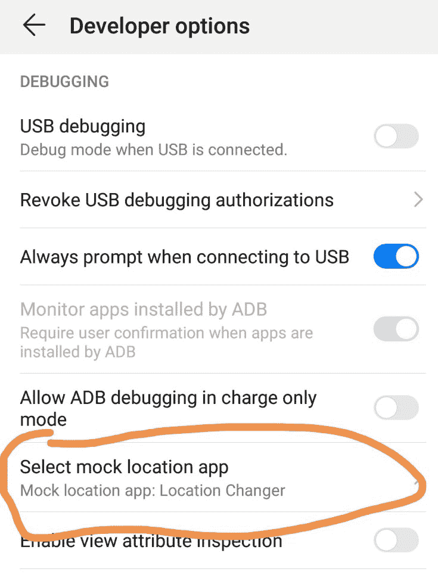
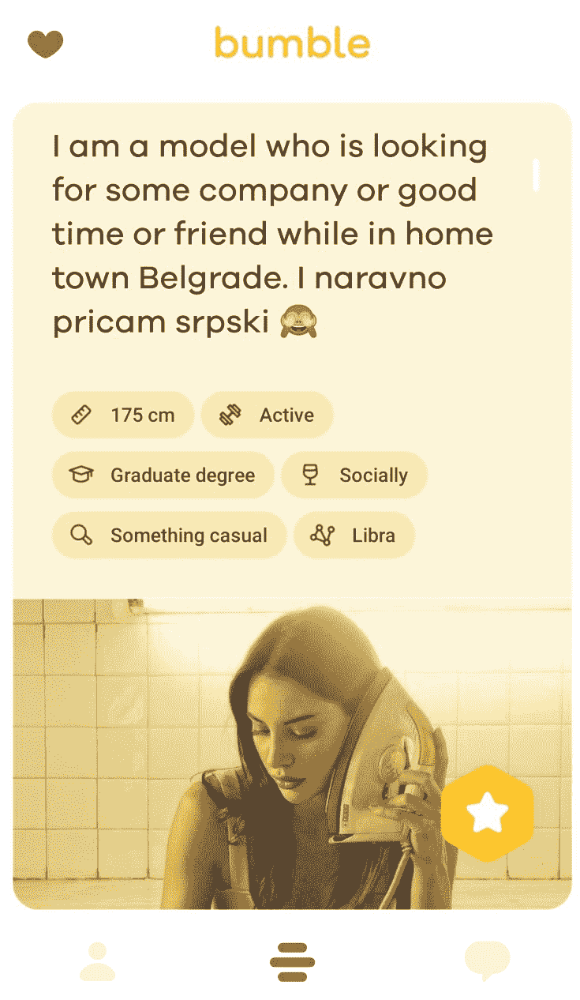

# 如何免费使用Tinder的更改地址的功能和异地姑娘匹配

> 原文：[https://piaohanshenghuo.com/change-location-on-tinder-for-free/](https://piaohanshenghuo.com/change-location-on-tinder-for-free/)

Tinder上有一个付费的会员“Tinder Plus”的Passport功能，可以让你把位置改到世界上任何其他的城市。不过Tinder Plus的年费需要58.36美元，我之前在用，因为还有每天5个Superlike，还可以rewind（滑错了可以后悔），无限滑，隐藏距离、年龄，每月一个Boost等功能。但目前疫情下的柬埔寨基本在Tinder上找不到美女，所以我就暂时没付费。

由于目前柬埔寨美女资源的匮乏，我在考虑下一个目的地。Serbia（塞尔维亚）看起来像个不错的选择，我可以免签在那里待90天，听说美女也很多。于是我想先用Tinder试探一下。

修改城市的额外好处：**每到一个新的城市，****Tinder****都会给你一个新手的****”boost”**，你的账号会比一般用户更靠前，更容易被美女发现，这个”boost”持续一天的时间。

做法具体如下：

以我用的是安卓手机为例，先去Google Play Store上搜一个修改GPS的APP，我用的APP叫”Location Changer”。    ​

在系统设置的”developer options”里的”Select mock location app”选择你刚下载并安装的修改GPS的APP。

打开修改GPS的APP，输入你想“瞬移”到的城市，我在这里选择“Belgrade”。

这时候你已经可以直接进入Bumble（类似Tinder的约会APP），用修改后的地址了。但是Tinder已经发现了这个Bug，如果直接用Tinder的APP的话是没法修改地址的，不过还可以用Tinder的网页版：[https://tinder.com/?lang=en](https://tinder.com/?lang=en)，随便用个浏览器就可以上。

之后就可以免费瞬移，在你去下一个目的地之前打好和美女约会的基础。

最后不得不说塞尔维亚的美女真美！

相关阅读《[Tinder怎么用？Tinder网上约会攻略](https://piaohanshenghuo.com/tinder_guide/ "Tinder怎么用？Tinder网上约会攻略")》

**熬夜码字不易，欢迎以打赏、分享、转发、点页面右下角的“在看”和“点赞”等方式以示支持。**

**另外，还可以点击公众号文章底部的广告来支持我（每个成功的点击量可以帮我赚几毛钱）**。

**谢谢！**

* * *

剽悍生活UL(微信公众号)分享关于**两性关系**、**自我提升**、**数字游民的生活方式**的原创内容，帮你过上更理想的生活（尤其是性生活）。

剽悍生活的个人微信号：ycf3721，[一对一视频教学](https://piaohanshenghuo.com/1on1_coaching/)，或拉你进入[剽悍生活泡妞讨论群](https://piaohanshenghuo.com/ul-wechat-group/)，请注明加我的目的。

