# 柬埔寨的摩托艳遇之旅（柬埔寨攻略、物价、游记）

> 原文：[https://piaohanshenghuo.com/my-cambodia-experience/](https://piaohanshenghuo.com/my-cambodia-experience/)

继《[历时40天的老挝摩托之旅](https://piaohanshenghuo.com/my-laos-experience/)》和《[如何骑摩托从老挝去柬埔寨（我和边境贪官斗智斗勇的故事）](https://piaohanshenghuo.com/laos-cambodia-border-troubles/)》后，我成功进入了柬埔寨的东北角，开始了我的柬埔寨的摩托之旅。

柬埔寨的自然景观是我去过的东南亚国家里最差的，整个国家基本都是无聊的平原，如果你认为地势很平，骑摩托车就会很容易，那你就错了，因为柬埔寨有很多地方的路况都很差，坑坑洼洼的土路很多。

我在柬埔寨的第一个月花了大概1330美元（大概一万元人民币），是我在东南亚各国中旅行花费最多的一次。柬埔寨作为最穷的东南亚国家，可一点儿都不便宜，食物是东南亚国家中最贵的。

**柬埔寨的食物相对于收入来说非常贵**，在首都金边（工资最高），刚毕业的大学生一个月工资也就400美金左右，但最普通的餐厅里的最普通的炒饭也要2美元，下图为我在我的Instagram上的截图，在金边的一个还不错的咖啡店里的一盘三文鱼沙拉，只有3片薄薄的三文鱼，一大堆草，售价8美金，完全吃不饱。得去当地人去的菜市场，直接在家做饭才会比较便宜。

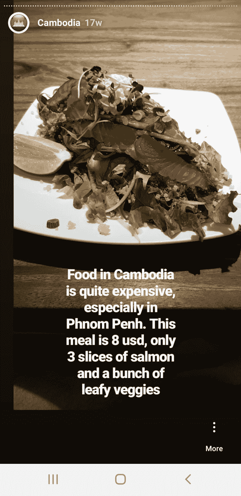

**柬埔寨的平价单间旅馆普遍在****10****美金左右**，首都金边除外，那里的住宿和食物都远高于其他地区。

下图为Siem Reap（暹粒）的一间12美元一晚的房间：

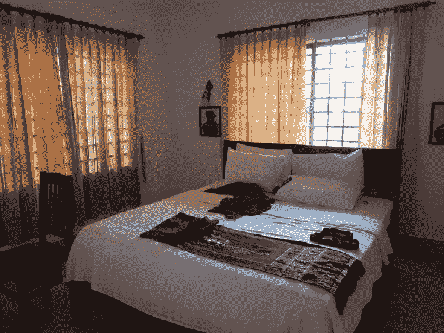

柬埔寨流通两种货币，一个是美元(USD)，一个是Riel（KHR），汇率常年保持在1USD=4000KHR左右，大额交易都是用美元，找零的时候都用KHR，我还没见过面额超过20K的KHR（相当于5美金）。建议去超市等地方购物的时候使用美元，因为那里的汇率很可能不好，一美元等于4000多KHR，花KHR的话就不划算了。

另外，还有一个很奇怪的现象，大部分人都不接受2美金的纸币，不知道为什么。既然提到了2美金，我再跑个题，我利用2美金不能花这件事在Siem Reap的一个叫XBar的酒吧自然地搭讪了一个英国美女，并当晚就把她带回家了。

当时她正独自在酒吧用2美金的纸币买酒，酒保不收，她很困惑，正在和他们理论。我顺利地切入，告诉她我也经历了很多次被拒绝用2美金纸币的情况，不知道为什么，没人能解释……但有的时候偶尔会有人接受，我主动用2个一美金的纸币换了她的2美金的纸币，她成功地用我的2个1美金的纸币买到了酒，对话就这么自然而然地开始了。她在和我上床后还和我说她一般不会理会直接上来搭讪的陌生人，但因为我搭讪地非常自然，这次是例外。这又再一次验证了我的说法：**最好的开场白是根据当时的具体情况随机应变**。

早上姑娘在我房间里的背影

回到正题，我在柬埔寨的第一个“落脚地”是Krong Stung Treng，边境南边的第一个城市。我在那里办了一个电话卡，运营商是Metfone，5美金一个月5GB的流量。

这个城市好像没什么特别的，我只看到了一个很酷的卖货的三轮车。

之后我一路向西推进了一百多公里，路况不错，在日落后到达了第一天晚上的落脚地——Krong Preah Vihear。

第二天继续向西赶路，路过一个叫“Thom Temple”的古庙遗迹，没想到居然在门口被要10美元的门票，我本来就是在赶路，就想顺便看看，居然要10美金，算了。

虽然没看到庙，但是我看到了我见过的最大的三角梅树，花开正艳。

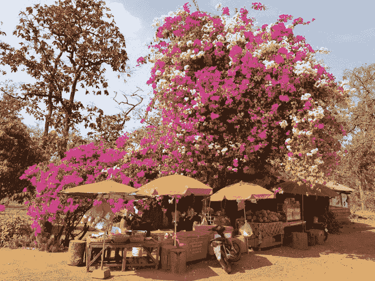

我继续赶路，终于在日落时分到了暹粒，暹粒是我第一个想认真游览的目的地，这里有世界闻名的Angko rWat（吴哥窑）。

吴哥窑只是众多古庙中最著名的，还有很多庙，我去了很多，其他我觉得值得一去的古庙还有Ta Prohm Temple，Pre Rup，Phnom Kraom。

作为外国人，想去这些庙可真不便宜，一天的通行证就要37美金，3天的通行证要62美金，一周的通行证要72美金。

我当时是傻傻地和另一个我泡到的英国空姐和她的空姐同事一起各花了37美金去的。

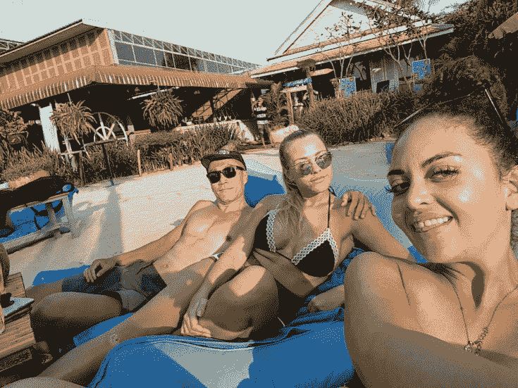

**后来我才知道有办法免费参观这些古庙**：**下午****5****点之后去就不检票了**，但是天6点多就黑了，所以要多花一点儿时间每天去看一两个。

**如果你决定要花钱集中在一天看很多庙的话，我强烈建议你准备自己的食物和水**，因为这些古庙附近的饭店宰人都非常狠，一道非常普通的很油腻的炒饭能卖5美金（同品质的炒饭在外边只要2美金）。

吴哥窑几乎是每个去暹粒必看的古庙，是世界上最大的宗教建筑体，1992年被列入世界文化遗产，柬埔寨的国旗上都有，可见其重要性。

但我并是不是十分感冒，在身临其境后并没有什么震撼的感觉。而且因为这个地方太著名，所以人满为患，游览体验并不是很好。

在吴哥窑看日出

**Ta Prohm Temple**是大片儿《古墓丽影》的拍摄地之一，古庙和大树完美地结合在一起，**是我在柬埔寨最喜欢的古庙**。这个庙同样人满为患，下图为我在新冠病毒泛滥、柬埔寨关闭边境之后、重游时照的，不然很难不照到游客。

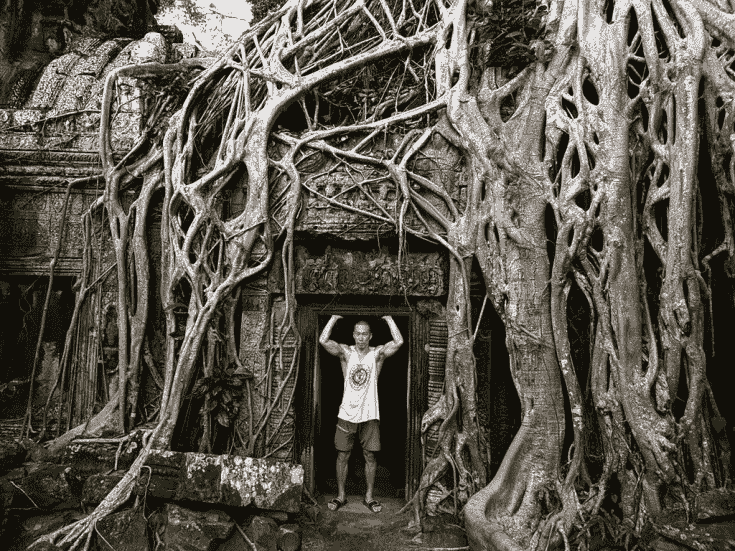

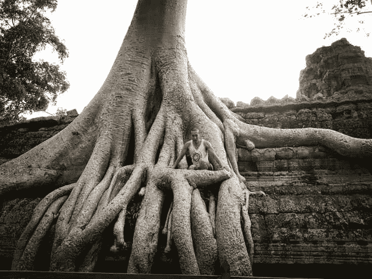

图中的白色背心是我在夜市1美元买的，在柬埔寨买背心很便宜！

Pre Rup是几个很高的古庙之一，爬到庙顶后的风景很不错。

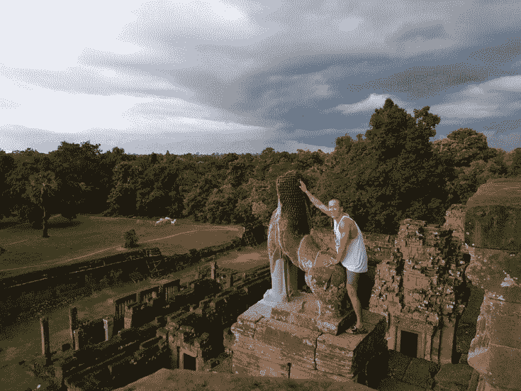

除了古庙之外，暹粒还有一些其他值得一去的地方：

Lotus Farm（荷花农场）：可以免费去，而且还可以选择在这里就餐，到处都是荷花，风景很不错，尤其是日落时分。

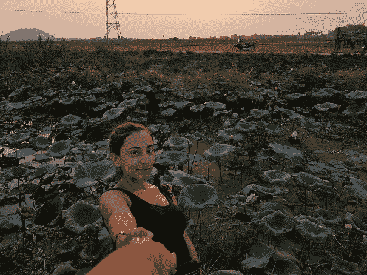

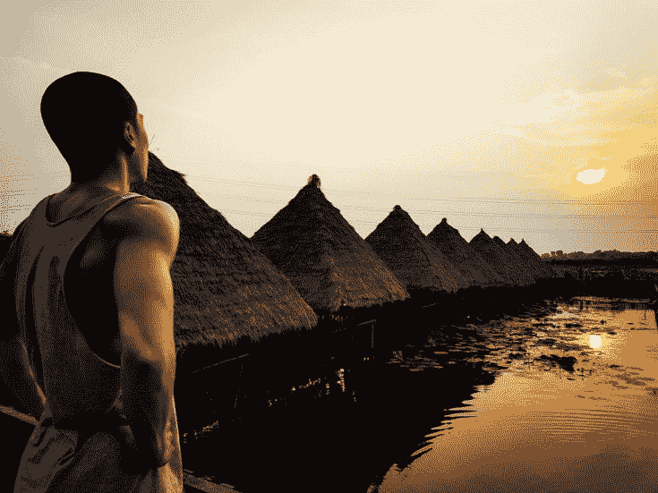

Floating Village（水上的村庄）是另一个比较热门的景点，这样的村庄最少有三个，都在南边的Tonle Sap（东南亚最大的淡水湖）附近，但我感觉这些地方都是宰人。我自己骑车去了其中的两个，去的时候是旱季，应该可以骑摩托参观。但是在村子“门口”被拦住了，要我花20美金买“船票”，我说我想骑摩托先转转，他们不让，说我必须得交5美金才可以骑摩托转转……算了……

我已经看过了我最喜欢的Youtuber之一“Wonton Don”关于这个floating village的视频了（https://www.youtube.com/watch?v=JtLyv-VA75g），不去也罢。

我在暹粒最喜欢的餐厅叫“My Little Cafe”，物美价廉，干净卫生，味道还很好，服务员态度好，说英文。我最喜欢的几道菜有: Grilled Fish with Green Mango(3.5 usd), Fresh Spring Rolls(1.5 usd), Spicy Butter Chicken(3 usd)，我在这里吃了好几个月，直到我后来住进了一个有厨房的公寓（后来被困在了柬埔寨，没法去越南，我就索性待在暹粒）。

在暹粒最适合泡妞的地方叫”X Bar”（《[剽悍故事No.10 新年第一炮，英雄救美她爹](https://piaohanshenghuo.com/ul-story-10/)》就发生在这儿），晚上12点、1点之后最热闹，另外推荐”YOLO Bar”，离XBar大概2分钟的步行距离。另外推荐晚上在Night Market（夜市）和Pub Street（酒吧街）搭讪。适合泡妞的青旅有：Funky Flashpacker, Mad Monkey, White Rabbit等。

另外，**强烈推荐我遇到过的性价比最高的按摩地点**，没有名，在Night Market St上，在谷歌地图上搜”Bell Restaurant”，就在这个餐厅的隔壁。

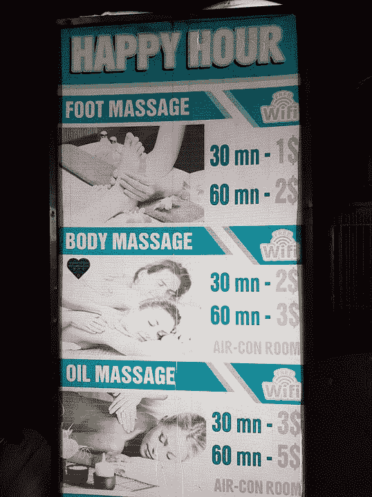

这个地方有个happy hour，在晚上5点到6点，全身的按摩只要3美元（21元人民币），打听后得知：按摩的人每小时只赚1美元，建议给小费，我一般会给2美元小费。在happy hour以外的话要5美元一小时（按摩的人每小时赚2美元）。请注意：happy hour和happy ending是两回事。我从来没买过happy ending，不过柬埔寨应该有很多这种店，有一次我去了一个表面正规的店，按摩按到一半突然问我要不要给我口，我说算了吧。

下一站，Battambang

Battambang我很喜欢的一个目的地，在暹粒的西南方，大概3小时的车程，路况很差，大量路段都在修路，到处都是尘土，坑坑洼洼。

推荐的目的地：

Battambang Crocodile Farm（鳄鱼农场）：

门票只要2美元，还可以手握小鳄鱼。农场的工作人员告诉我这里的大鳄鱼一只400美元，小鳄鱼一只只要10美元。这里有好几百只鳄鱼，每周统一进食一次（上吨的死鱼），好像是周三早日9点左右。

Banon Bamboo Train（竹火车）和Phnom Banan Temple（山上的一个庙）：

门票5美元，可以坐简易的“竹制火车”，从起点到终点大概要10分钟左右，往返大概20分钟。是个比较有特色的项目，值得一去。

**视频**：

<video controls="controls" width="600" height="300"><source src="https://piaohanshenghuo.com/wp-content/uploads/2020/08/bamboo-train.mp4" type="video/mp4"></video>

Phnom Banan Temple是离Banon Bamboo Train很近的一个在山上庙，建议顺道一起去。

Bat Cave of Phnom Sampov和The Killing Cave：

强烈推荐的旅游景点，这里每天傍晚时分会有无数只蝙蝠从山洞中飞出来，附近有很多观赏蝙蝠的座位，我花了1美元买了个椰子，边喝椰子边观蝙蝠。我在那里待了一个多小时，蝙蝠一直在往外飞，没完没了。我上一次看到这么多蝙蝠还是在澳大利亚的HerveyBay。

**视频**：

<video controls="controls" width="600" height="300"><source src="https://piaohanshenghuo.com/wp-content/uploads/2020/08/Bats2.mp4" type="video/mp4"></video>

看蝙蝠之前建议你去附近的”TheKilling Cave”，山顶的山洞，过去有很多人在这里被残忍地杀害。山上有不少诡异的雕像。这里会有一些小孩儿主动给你当导游，然后管你要钱。

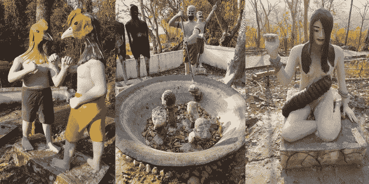

另外很推荐晚上大概7点之后去市内河边的公园（河东边），这里有一群在街头健身了10年的小伙儿（Cambodia Street Workout），个个身怀绝技，尤其是他们的队长Theary(Instagram:povtheary)，非常屌。他们还参加过Cambodia’s Got Talent的才艺展示类的电视节目。

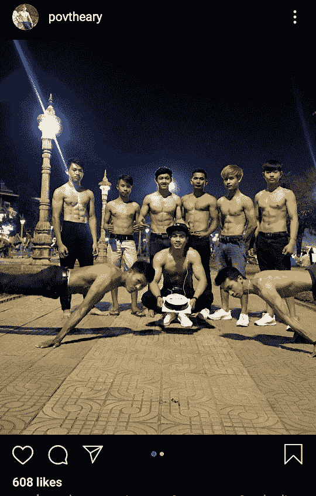

**视频：**

**<video controls="controls" width="600" height="300"><source src="https://piaohanshenghuo.com/wp-content/uploads/2020/08/CSW.mp4" type="video/mp4"></video>**

下一站：金边（柬埔寨的首都Phnom Penh）

从Battambang一路向东，整整骑了5个小时，终于到达了金边，已经晚上7、8点了，交通还是很堵，让我很吃惊，这是我在柬埔寨遇到的第一次堵车的情况，后来发现金边天天堵车，白天更严重……

我很讨厌金边，因为这里没什么值得看的东西，人太多，交通太差，白天到处堵车，晚上各种闯红灯的，脏乱差，但是物价很高。20美金以下一晚都很难找到像样的旅馆，我幸运地找到了个超高性价比的8美金一晚的“简陋”的旅馆（Okay Guesthouse），但是安静又干净，我很满意。

金边让我很失望，并不适合泡妞，游客不够集中，远不如暹粒。比较适合泡妞的地点是”Top Banana Guesthouse & Rooftop Bar”以及对面的”Club Love”。

最适合泡妞的青旅是Mad Monkey，另外强烈推荐他们每周一、周五的自助餐（Family Feast，如下图，晚上7点，只要5美元，是我在金边找到的性价比最高的晚餐）。

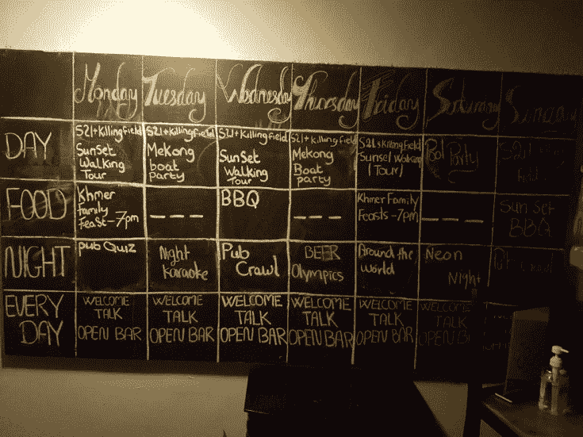

另外可以考虑去一下“GoldenTemple”，可以免费去的一个金色的庙。

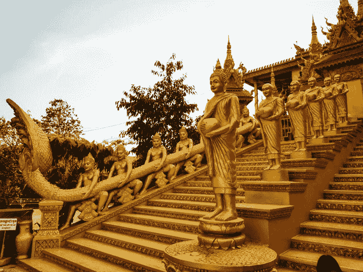

如果你像我一样喜欢锻炼身体，推荐河边的公园(谷歌地图搜riverside park)。

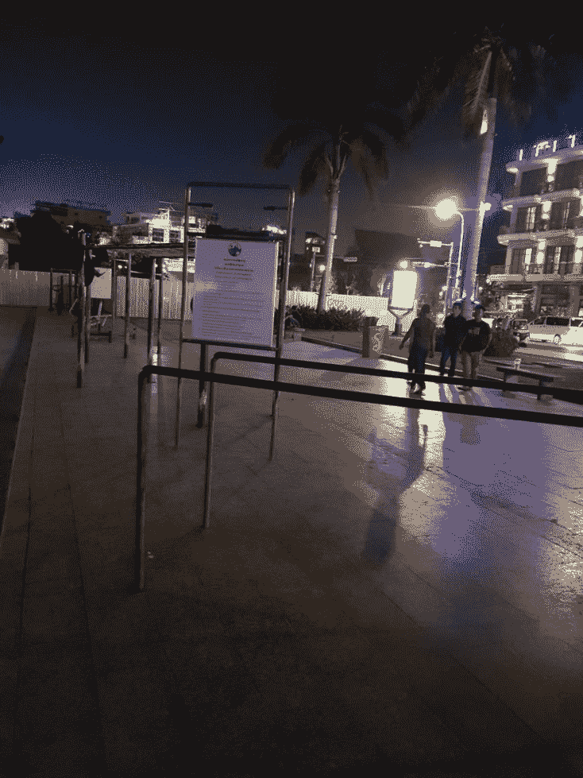

下一站：Kampot

从金边南下，3小时的车程，我到达了Kampot。在去了让我失望的金边之后，下一个目的地很容易让我满意，而且Kampot确实是个不错的小镇。镇中心有一个标志性的大榴莲转盘（Durian Roundabout）。

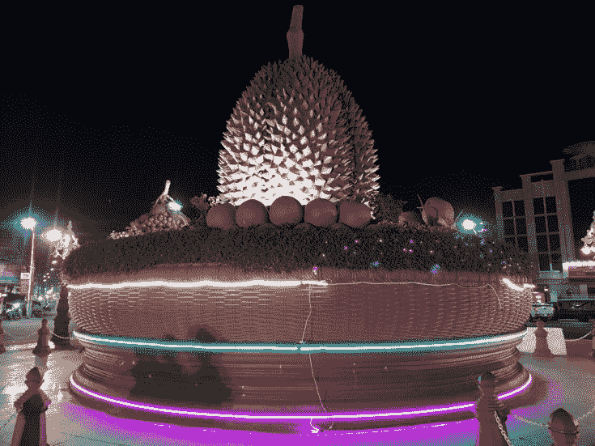

推荐的景点有：

Bokor Mountain：

在平坦的柬埔寨，能有个山实在是不容易，强烈推荐，路况很好，很适合骑摩托的一日游。山上有很多值得一看的地方，有湖，有瀑布，有庙，有五星级宾馆，还有个超大的水塔。

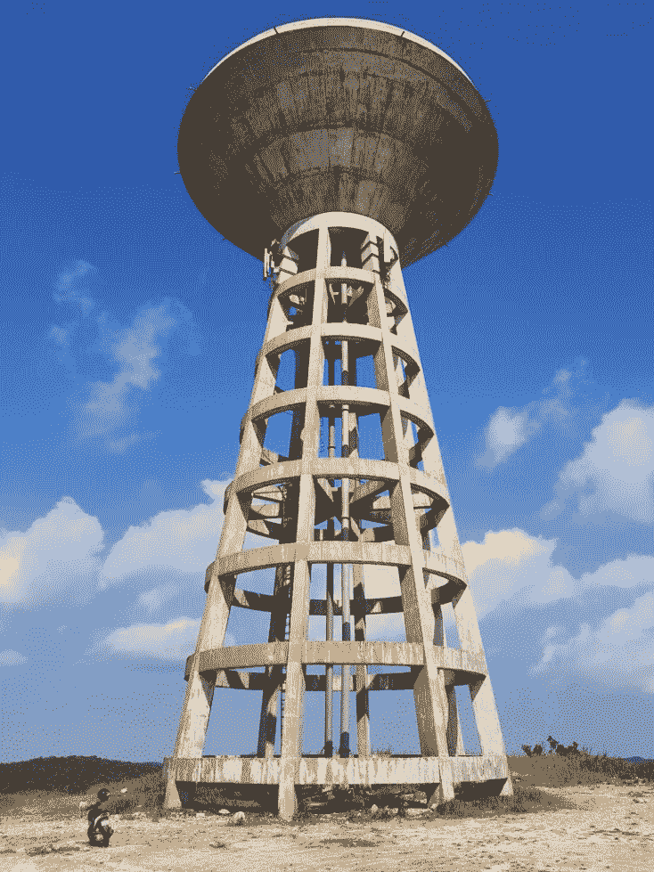

看看水塔和图中摩托车的大小对比。

推荐参观”La Plantation“胡椒农场，可以免费参观，还有英语或法语的导游，想不想买他们的产品完全自愿。

去胡椒农场的路上会路过一个叫”Brateak Krola Lake”的湖，推荐在湖边的一个叫”Khmer Root Café”的餐厅就餐，有机、健康又相对便宜的食物，还有可爱的猫和狗。

回家的路上可以顺便参观一下”Salt Fields Kampot”（盐田），下图为我在盐田边上发现的很酷的植物。

另外可以在参加一个在河上划船的项目（在你住的地方就应该可以报名），我并没有参加，不过应该不错。

总的来说Kampot并不是很适合泡妞，比较适合泡妞的青旅是Mad Monkey，晚上屋顶有酒吧，我在这里成功过（成功推倒了一个“拒绝”了我上百次的法国姑娘）。另外推荐Banyan Tree Guesthouse，好像是每周五或是周六有一个比较大的party。

另外我住过的很不错的旅馆有Mea Culpa（24美元一晚，有点儿小贵，但是非常完美，有我需要的一切），Fish Island Bungalows，也是个很不错的旅馆，我在这里度过的除夕夜，第二天鼠年第一天我一开门，在我门口看到了一块儿老鼠的鼻子……估计是某个淘气的猫吃剩了扔到我门口的。

**视频：**

<video controls="controls" width="600" height="300"><source src="https://piaohanshenghuo.com/wp-content/uploads/2020/08/rat.mp4" type="video/mp4"></video>

下一站:Kep

Kep距离Kampot半小时车程，被低估的一个海边小镇，强烈推荐。这里有我在全柬埔寨见过的最好的路况，马路又宽又平，干净，宁静，很适合放松的一个地方。

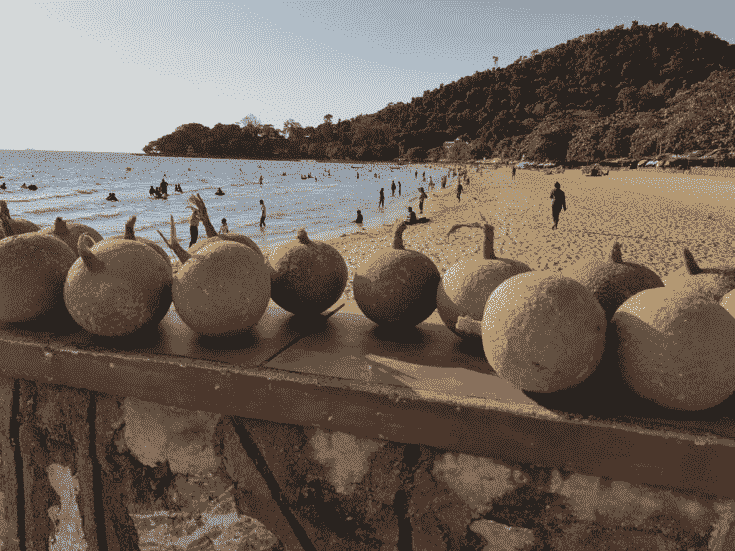

Kep海边的奇怪的植物​

这里的螃蟹比较有名，海边有个海鲜市场（Crab Market），可以吃到最新鲜的海鲜（螃蟹在海里的笼子里关着），蓝色的螃蟹6到8美元一公斤，现场就可以吃，可以选择炸或蒸。我当时被宰了，10美元一公斤买的。一公斤的螃蟹让我在海边吃了一个多小时。**去一个新的地方之前，建议在谷歌地图的评论区先做一下调查，以免被宰。**

**<video controls="controls" width="600" height="300"><source src="https://piaohanshenghuo.com/wp-content/uploads/2020/08/Kep.mp4" type="video/mp4"></video>**

另外推荐的目的地是Koh Rong和Koh Rong Sanloem

两个临近的小岛，听说风景很美，可惜因为我听说岛上的网络很差，还经常停电，贪财的我需要天天上网工作，就没有去，不过如果你要去柬埔寨旅游的话，一定别错过了Koh Rong，不但风景很美，而且很适合泡妞。

不推荐通往Koh Rong的港口城市Sihanoukville（西哈努克市），这个城市已经被中国的开发商给毁掉了​。

柬埔寨之旅大概就这样了。

因为新冠肺炎，我被越南政府无情地拒绝入境，当时其他国家还可以进，我已经快一年没在中国了，但是他们一看到我中国的护照就不让我申请签证了……

于是我选择了我认为柬埔寨最适合居住的暹粒，之后我会写一篇暹粒的生活攻略。

**熬夜码字不易，欢迎以打赏、分享、转发、点页面右下角的“在看”和“点赞”等方式以示支持。**

**另外，还可以点击公众号文章底部的广告来支持我（每个成功的点击量可以帮我赚几毛钱）**。

**谢谢！**

* * *

剽悍生活UL(微信公众号)分享关于**两性关系**、**自我提升**、**数字游民的生活方式**的原创内容，帮你过上更理想的生活（尤其是性生活）。

剽悍生活的个人微信号：ycf3721，[一对一视频教学](https://piaohanshenghuo.com/1on1_coaching/)，或拉你进入[剽悍生活泡妞讨论群](https://piaohanshenghuo.com/ul-wechat-group/)，请注明加我的目的。

