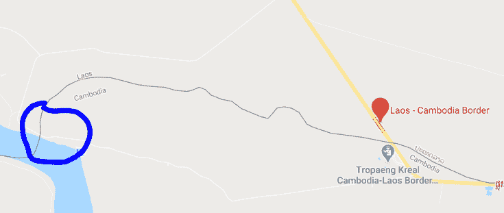

# 如何骑摩托从老挝去柬埔寨（我和边境贪官斗智斗勇的故事）

> 原文：[https://piaohanshenghuo.com/laos-cambodia-border-troubles/](https://piaohanshenghuo.com/laos-cambodia-border-troubles/)

老挝和柬埔寨只有一个边境，这给了那个边境的工作人员滥用职权、贪污腐败、恶心的机会。

早在我入境老挝之前就听说过那个边境的问题，很多人都在那个边境被宰了，尤其是骑摩托车的过境的人。

不像我从越南入境老挝，老挝那边根本不在乎我的摩托车，我交了签证费后就让我入境了。这个老挝和柬埔寨的边境丑闻百出，最糟糕的情况是老挝那边给你护照盖章放行后，柬埔寨那边因为你有摩托车而不让你进，于是你进退两难，这时会有一个人神奇地出现，以极低的价格要买你的摩托……

我一直都在为这件事担忧，在《[历时40天的老挝摩托之旅](https://piaohanshenghuo.com/my-laos-experience/)》这篇文章里也提过，我在这个叫”Don Det”的岛上还打听到了一个“偷渡”的生意，80美元的价格，会有人用船把你的摩托“偷渡”到柬埔寨那边，等你签证下来，入境柬埔寨后在一个人家的后院就可以和你心爱的摩托车重逢了，我把这作为一个备用选项。

现在终于到了过境的日子，我必须得想办法顺利过境。

我在谷歌地图上看了一下评论，各种坑蒙拐骗的情况都有, 比如要求你交很多钱才放你走的情况。

有一个人更是说他骑摩托去了55个国家，这个边境是收费最高的。

在网上做了调查后，我得知：在老挝那边你得交2美金的小费他们才给你盖章，在柬埔寨那边30美金的签证他们至少收35美金，否则不给你办。这7美金基本是必须得额外交的，否则就得和他们无休止地浪费时间，不值得。

在我决定过境的前一天，我骑摩托车亲自去边境做了调查。

首先，谷歌地图上显示西边其实有一条小路可以“不经过边境检查”就进入柬埔寨，如果真的可以的话就太好了，我可以先骑摩托到柬埔寨那边，隐蔽地停在边境附近，再步行到边境办手续，如果被柬埔寨这边先问到为什么没有老挝那边的出境章，我就假装迷路了。于是我先去那里实地考察了一下（如下图）。

显然这个计划太天真了，我去了那个地图上的漏洞那个点之后就被老挝这边的警察叫住了，告诉我不能过，而且柬埔寨那边还有持枪的士兵把守。

于是我原路返回，去西边的官方边境打探虚实。我向老挝这边的工作人员解释我的情况，我说：“我今天并不打算过境，不过我想去柬埔寨那边打听一下我的越南摩托到底能不能过境。”老挝这边很爽快地放行了，于是我在柬埔寨那边打听负责摩托车的官员，被告知要去一个办公室。我估计办公室里等待我的肯定是一个油腻的中年大叔，推开门后居然发现是一个“文质彬彬”的姑娘。

于是我就和她说明我的情况，我说我在网上看到了很多负面的消息，我不太确定我是否能骑越南的摩托入境柬埔寨。她说可以，但是需要交钱。我问多少钱。结果她居然问我：“你打算交多少？”我服了，这是明目张胆收黑钱啊，还没有一个明确的数。

虽然想，但是我没敢说5美元，怕激怒她，我说10美元，她讨价还价要20美元，我说咱俩各退一步，15美元好了。她同意了……

我告诉她明天见，很高兴地回家了，还特意告诉我朋友，我不需要花80美元的偷渡费了，15美元就可以搞定了。

第二天，我带着所有的行李来到了边境，老挝这边要求我确保柬埔寨那边可以放我的摩托车过去，他的意思好像是要我去柬埔寨那边拿一个同意让我的摩托车通行的文件再回来办理老挝的出境手续。于是我去柬埔寨那边，把15美金的贿赂钱都准备好了，放在她的桌子上，她表示并没有什么文件，但是放心，肯定能过。于是我收回我的15美金，说一会儿见，我先去老挝那边办手续了。她居然说“能不能先给我15美金”，我说我回来再给你钱，一手交钱，一手放行。

于是我回到老挝那边，办理了出境手续，果然被收了2美金的黑心钱，我没有争论，直接交了。浪费时间、影响心情不值得。

到了柬埔寨边境这边，这时我的大脑在很快地运转，观察周围的环境，办理签证的办公室离入境柬埔寨的大门大概有100米远，大门是敞开的，好像也没有人把守。如果我趁工作人员不注意，骑摩托冲过去的胜算是很大的。

于是我先不去交15美元的贿赂，而是先办理签证，官方的价格是30美元，我在网上的调查显示他们普遍收35美元，出乎我意料的是这个无耻的大叔居然张口要40美元。给我气到了，于是本来打算交35美元省事的我突然只想交30美元了，他改口说35美元，我坚持30美元，结果这B压根就不理我了，拒绝服务。我一想算了，于是交了35美元，办好了签证，盖了入境章。整个过程大概10分钟，当时只有我和另一个法国姑娘两个游客。

现在我已经可以合法地进入柬埔寨了，等着我的15美金的贿赂的姑娘还在办公室里。我一想，去他妈的，我才不白给你15美金呢，我打算赌一把，打算直接骑摩托冲入柬埔寨。

于是我假装正常地走向我的摩托，假装坐在摩托车上喝水，我看了一下，并没有人很警惕我的行为。于是我孤注一掷，迅速插入钥匙，启动发动机，以最快的速度逃离了现场，身后传来气愤的叫喊声，我头也不回地冲出了大门。在门口看到了办签证时看到的法国姑娘，我来不及打招呼，继续全速向前冲了几公里，确定不会有人追上来才松了一口气。

我成功了！总共花费37美元（7美元是额外的但必交的贿赂）。

希望这篇文章能帮助到骑摩托从老挝去柬埔寨的朋友们。

**熬夜码字不易，欢迎以打赏、分享、转发、点页面右下角的“在看”和“点赞”等方式以示支持。**

**另外，还可以点击公众号文章底部的广告来支持我（每个成功的点击量可以帮我赚几毛钱）**。

**谢谢！**

* * *

剽悍生活UL(微信公众号)帮你从**健康、两性关系、生活方式**三个方面全面提高自己，打造理想的生活（尤其是性生活）。

剽悍生活的个人微信号：ycf3721，[一对一视频教学](https://piaohanshenghuo.com/1on1_coaching/)，或拉你进入[剽悍生活泡妞讨论群](https://piaohanshenghuo.com/ul-group-chat/)。

**长按下图扫码关注公众号**

