# 历时40天的老挝摩托艳遇之旅（详细的老挝攻略，包括详细的老挝物价，图多慎入）

> 原文：[https://piaohanshenghuo.com/my-laos-experience/](https://piaohanshenghuo.com/my-laos-experience/)

我在老挝待了40天，(2019年11月中旬到12月末，没有下过一场雨)，一共大概花了11042K LAK(老挝基普)，合8721元人民币（1000老挝基普合8毛人民币），主要使用住宿、食物和汽油。

首先，老挝的落地签为20美金，只有30天的时限，想多待的话可以2美元一天在移民局申请多待的天数，否则超过30天后每多待一天要交10美元的罚款。在老挝很多地方都接受美金和泰铢。

老挝和泰国很相似，语言也很接近，老百姓普遍看泰国的电视节目，不过老挝没有泰国发展得快，但是价格却往往比泰国要贵。

老挝的基础设施比较差，很多地方的路况都很差，尤其是从万象到万荣的必经之路。互联网普遍很慢、很卡，而且买个带流量的Sim卡也非常贵，我为了确保有足够的流量用于工作，买了个一个月30GB的卡，花了我210K（合人民币160多块钱）。

平价旅馆的价格一般至少要100K（合80元人民币），如果你还没有用过Airbnb（爱彼迎），可以使用[这个优惠链接](https://piaohanshenghuo.com/recommends/airbnb/)，第一次使用的话有53美元的优惠。

**最好的换老币的方式**：**找当地的中国商户用微信或支付宝转账换他们的现金**。我刚开始是用的银行卡在ATM取钱，不但每次取钱都会有两笔手续费（20元人民币），汇率也不是最好的，而且每次最多只能取一百万老币（大概800块人民币），非常不划算。和当地的中国商户换不但完全没有手续费，而且汇率也可以参照最好的中间汇率。

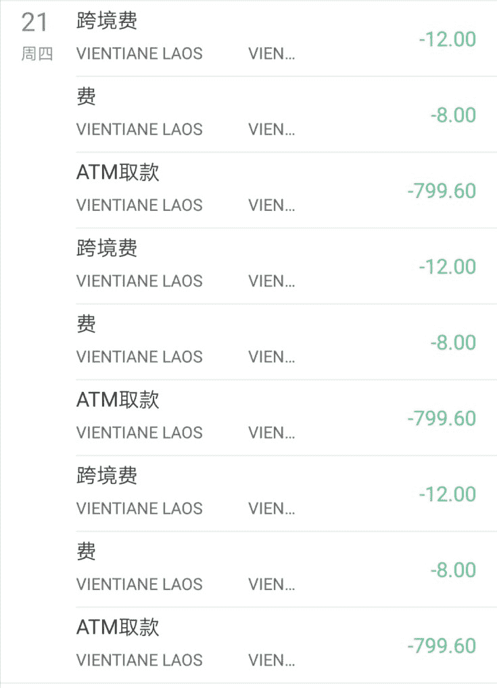

到老挝的第一天我从越南和老挝的边境(Lao Bao Border)一路向西开到了靠近泰国的边境，当晚下榻在一个路边的旅馆。

平价旅馆单间一般至少要100K（80人民币）。

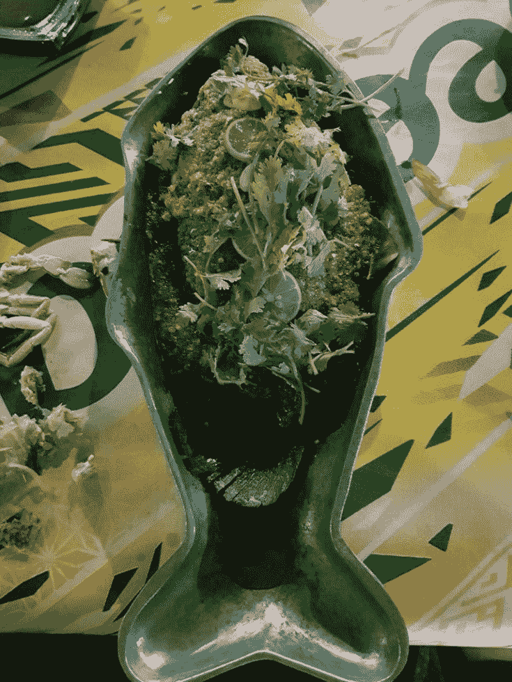

<figcaption class="wp-caption-text">我在老挝的第一顿饭，三道菜花了我大概50块钱</figcaption>

第二天我一路驱车去首都万荣，一路有很多当地人民向我投来好奇而友好的目光，下午一点多出发，晚上8点多才到。

老挝街边的食物还是比较便宜的，比如我在首都万象(Vientiane)的街边找到了8毛(1K)一串的鸡内脏肉串，在万荣(Vang Vieng)买到了8毛一串的牛肉串。

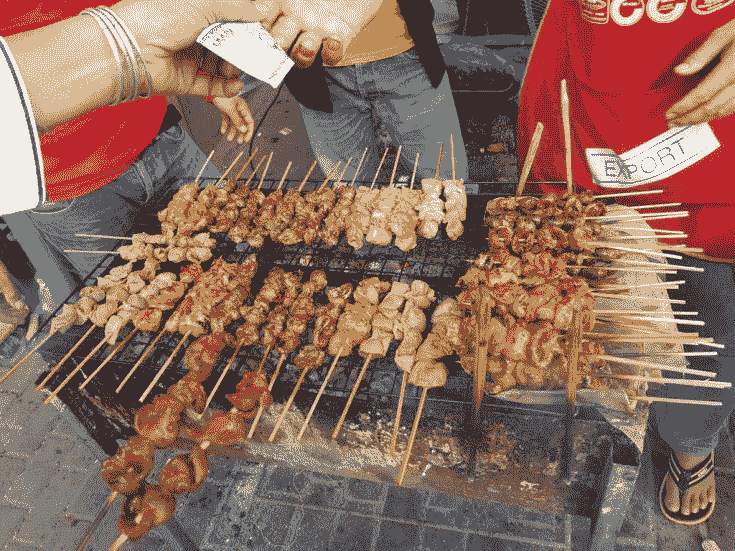

<figcaption class="wp-caption-text">首都万象的鸡内脏摊儿，旁边还有各种青菜可以免费吃</figcaption>

我一天吃两顿饭，吃路边摊的话一顿饭不到30块钱肯定能吃饱，往往20块钱就够了。

万象(Vientiane)

万象(Vientiane)作为我在老挝的第一个真正的落脚点，又作为这个国家的首都，其实是很让我失望的，整个城市都挺无聊的。夜生活非常糟糕，我检查了网上推荐的几个地点，基本没戏，很少能看到任何欧美游客（我的目标），不建议你在这里晚上出门打猎。

我在万象待了4天，只通过Tinder约到了一个英国的姑娘，幸运的是我成功把她推倒了:)

不过万象有3个地方还是很值得一看的，一个是”**Pha That Luang**“，一个金色的庙，门票为10K（约8块钱人民币）。

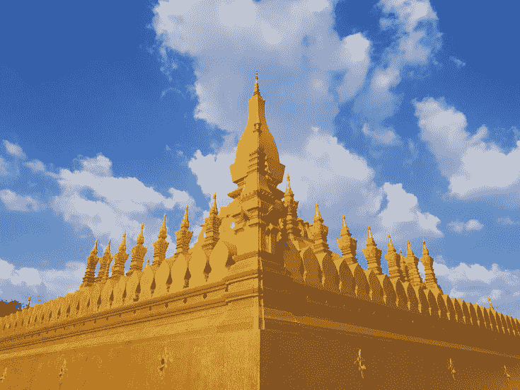

一个是“**Patuxay Monument**”，市中心的纪念碑，免费。

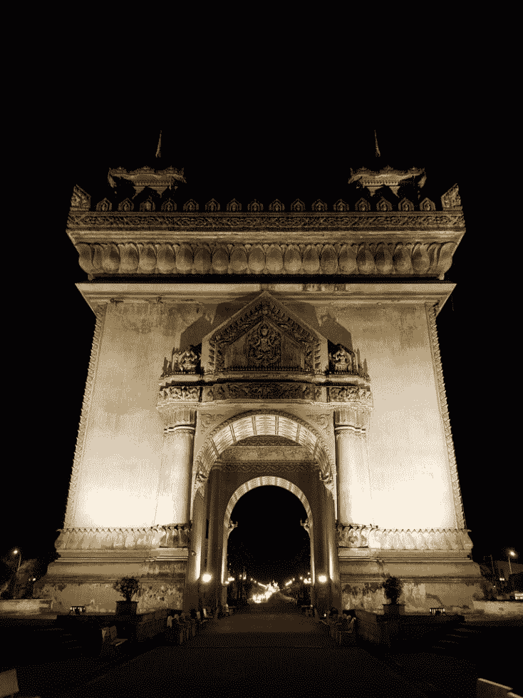

另一个是“**Buddha Park**”，距离市中心至少半小时的车程，门票15K。很有特色的一个地方，一个有各种形态各异的佛的公园，值得一去。

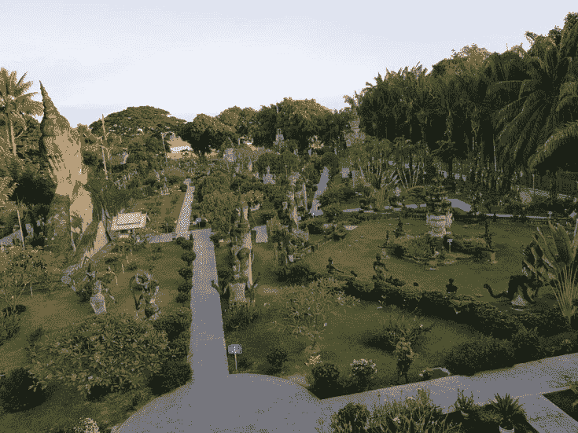

里边还有一个很诡异的建筑，从怪物的嘴可以进去，一路可以爬到屋顶，上一张照片就是在屋顶照的。

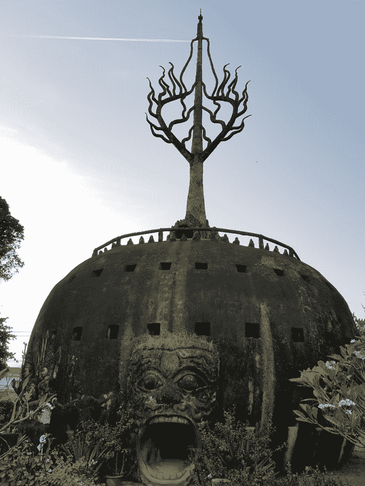

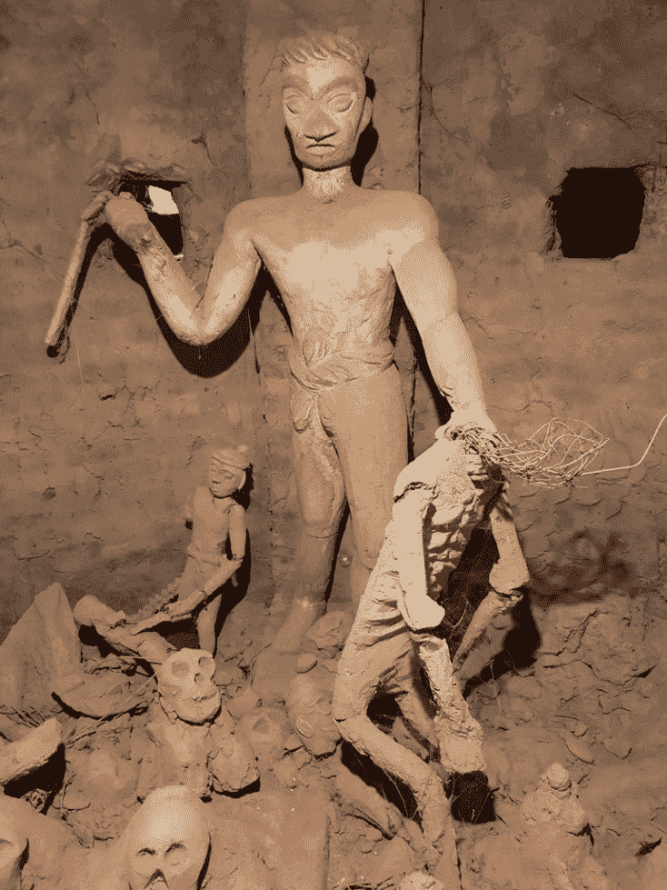

建筑内部也很诡异。

总之这个Buddha Park是我在万象最喜欢的地方，推荐。

万象总体来说很无聊，于是我在4天后驱车赶往万荣(Vang Vieng)，路况很差，坑坑洼洼，还有不少尘土，路边不时有写着中文的正常施工的项目。

**万荣(Vang Vieng)**

万荣是老挝的旅游重镇，也确实很好玩，景色也很好，有很多值得一去的地方，而且基本都在半小时的车程之内，很方便。这里韩国人莫名地多，很多地方都有韩语的标识。大部分游客的住宿都集中在方圆2公里之内，游客相对来说很密集，比较适合泡妞，具体的适合泡妞的地点请阅读我之前写的《[万荣(Vang Vieng)夜生活泡妞攻略](https://piaohanshenghuo.com/vang-vieng-nightlife-guide/)》。

很值得一去的地方有：

**Nam Xay Viewpoint**，这就是我下边这张照片的出处，让我搭讪的荷兰姑娘帮我拍的：

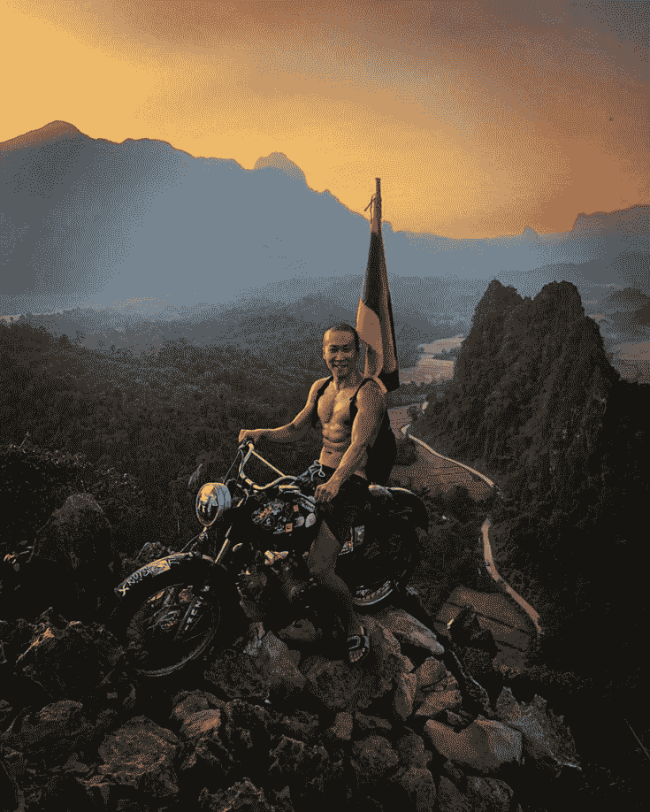

另外的类似的很值得一去的山顶是：Silver Cliff  View Point和Pha Ngern View Point。

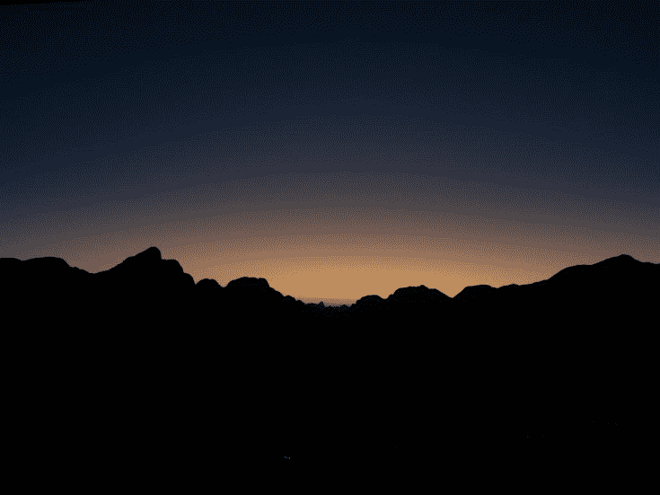

<figcaption class="wp-caption-text">在Silver Cliff View Point 黄昏的美景</figcaption>

另外推荐你去**Blue Lagoon 5**，万荣有至少5个Blue Lagoon，天然的小湖，在我去过的湖之中Blue Lagoon 5是最好的，有水上的zip line，跳台，独木桥等，还可以爬山，在半山腰远眺。湖水很清澈，还能看到鱼，和朋友在这里玩一下午是件很爽的事情。

<video controls="controls" width="800" height="400"><source src="https://piaohanshenghuo.com/wp-content/uploads/2020/05/2019-11-26-15.15.04.mp4" type="video/mp4"></video>

上述景点都在小镇的西方，有个桥是必经之路，过桥费是10K，所以建议你一次多去几个景点，省过桥费，上述景点的门票都很便宜，基本都是10K老币（8块钱人民币）。另外步行会比较远，像我一样骑摩托不错，建议至少租个自行车。路况很差，基本都是非常颠簸的土路，有不少人租越野四驱车在这里开，所经之处都是尘土飞扬，建议你带个口罩。

另一个很有特色的很推荐的景点是北边的一个洞穴**Tham Nam Water Cave**，你可以在这里租一个救生圈（大型卡车内胎）和头灯，很便宜，具体多少钱我忘了。你可以漂在水上，顺着缆绳一路往洞穴里走。我当时是自己下午去的，当时居然一个人都没有，我自己刚到洞口就害怕了，里边黑洞洞的，水很凉，不敢自己一个人去，怕进去了就出不来了……

我在洞口徘徊了一会儿之后终于决定放弃了，打算离开，就在这时，出现了一对情侣，于是我加入了他们，组成了一个3人的”探险队“，有了其他人的加入，黑洞洞的洞穴就没有那么吓人了。这个洞穴很深，一路走到绳索的尽头大概要花半小时，绳索到了尽头，洞并没有到尽头，谁知道还有多远，胆小的我们沿着绳索又原路返回了。进去的过程中我们又遇到了另一对情侣，我们出来之后才出现了一大批来自同一个青旅的年轻游客。

另外推荐东边的一个瀑布“Kaeng Nyui Waterfall”，路况同样崎岖，门票同样是10K。有可以游泳的天然泳池，还可以站在主瀑布的下方，让强劲的水流冲击你的身体。

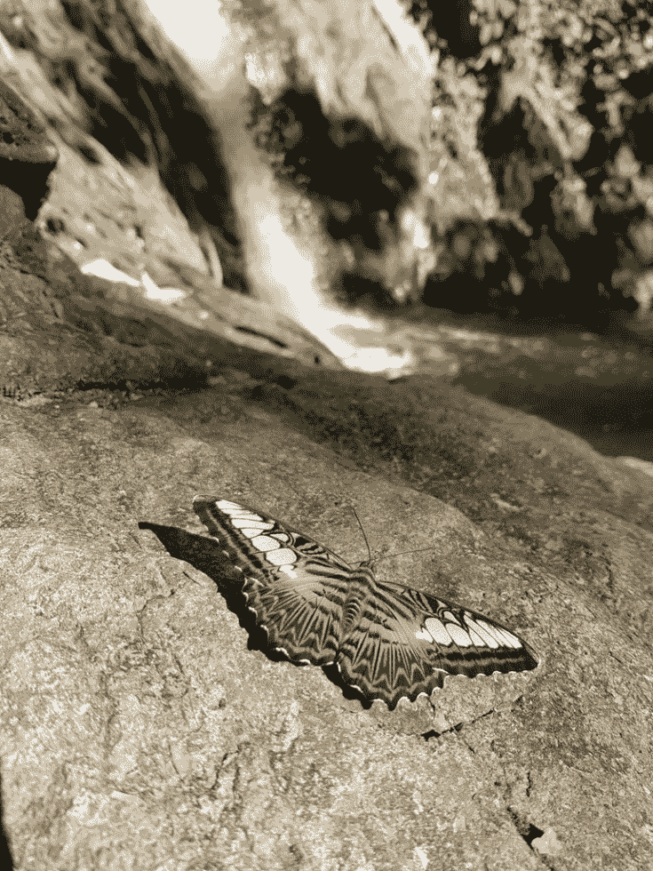

<figcaption class="wp-caption-text">瀑布边上的蝴蝶</figcaption>

另外很推荐的一个项目是”**Tubing**“，基本上就是一大群人在河的上游用一个大型卡车内胎一路漂到河的下游（有车接送），期间可以停留在不同的酒吧，一起party，玩游戏等等。这个项目曾经是老挝最火的项目，河边有好几十家酒吧，河边各种滑梯、跳台等等好玩的东西。

但是由于有很多人酒喝太多、毒吸太多，事故频发，很多人都受伤、甚至死亡，一年能死20多人。后来政府把这个项目整顿了，目前每天只允许开3家酒吧，而且河边大部分好玩的东西也都拆了。不过还是很好玩，很独特的经历。建议通过一个青旅订票，这样有更大的几率碰到年轻的美女，票价60K。

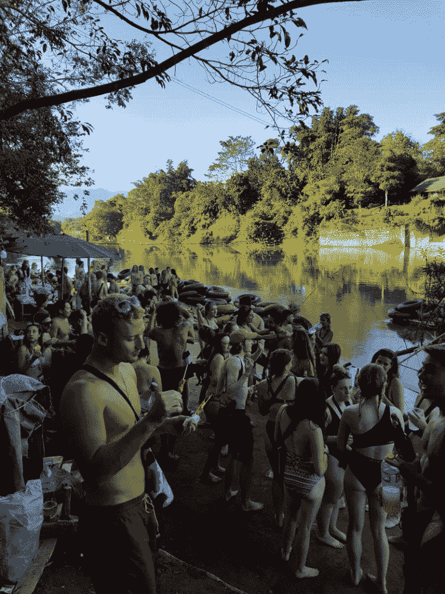

<figcaption class="wp-caption-text">河边的party</figcaption>

另外推荐南边的Jang Cave，洞穴本身没什么特色，但是一路景色都不错，洞穴的底部还有凉爽清澈的泉水，可以游泳。

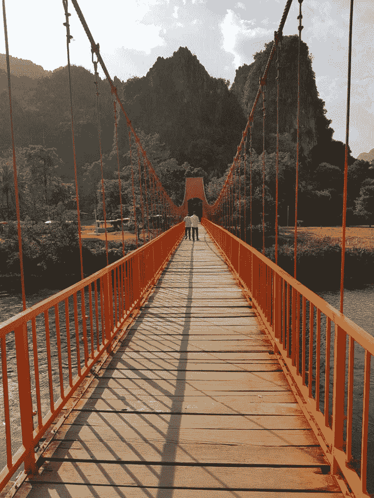

<figcaption class="wp-caption-text">通往洞穴的一座桥</figcaption>

**最后我再强烈推荐一下一个无名的路边摊，这里只卖牛肉串，1K一个（合人民币8毛钱），是我吃过的最好吃、最划算的牛肉串（水牛的肉）**。具体地址为：https://goo.gl/maps/uYWjmqdpSc2MRLfx9（复制粘贴在浏览器里就能在谷歌地图上看到具体的位置）。

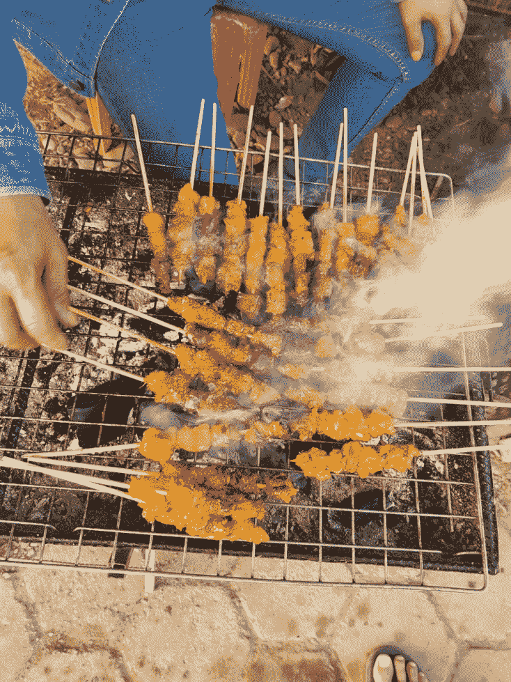

万荣是老挝旅游气息最浓的地方，游客密度最高，最适合泡妞的地方。具体的万荣泡妞攻略请看我写的《[万荣(Vang Vieng)夜生活泡妞攻略](https://piaohanshenghuo.com/vang-vieng-nightlife-guide/)》

我在万荣待了一周的时间，很爽，但是想去的地方我基本都去过了，于是我驱车前往下一站：琅勃拉邦(Luang Prabang)，路况同样不是很好，而且开始有不少山路了，12月份在山上骑摩托还是比较冷的，有的地方需要穿长袖。

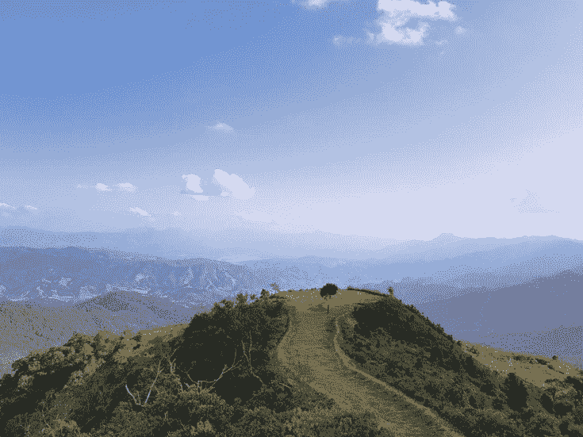

有山路的地方往往有美景

**琅勃拉邦(Luang Prabang)**

琅勃拉邦乃至整个老挝最著名的景点就是**Kuang Si Waterfall**，我去看了一下，果然名不虚传，是我见过的最美的瀑布，没有之一，强烈推荐。瀑布有很多层，可以在很多层游泳，瀑布的水有一种很特殊的颜色。

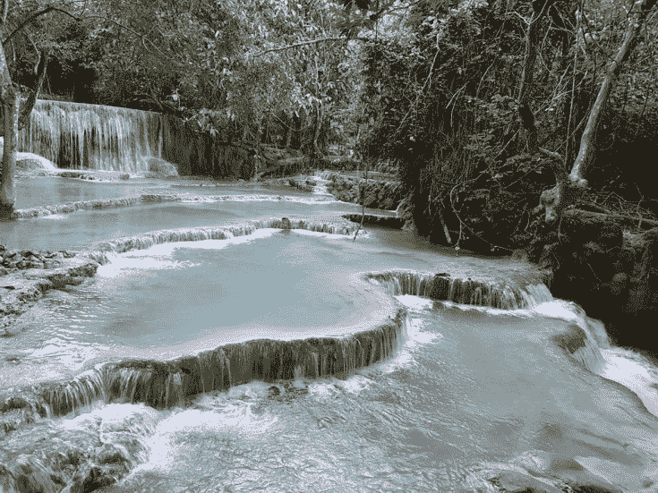

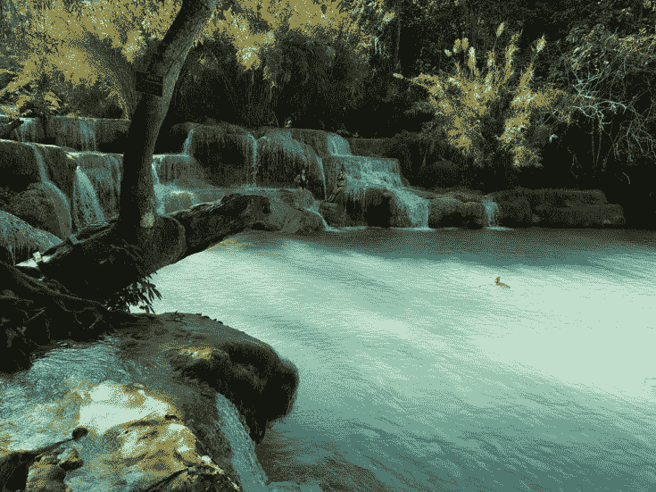

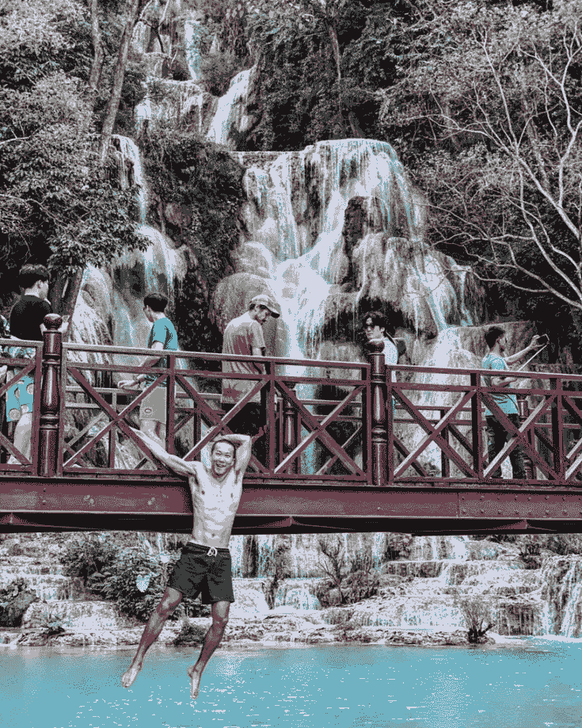

<figcaption class="wp-caption-text">在最高层的主瀑布前留影</figcaption>

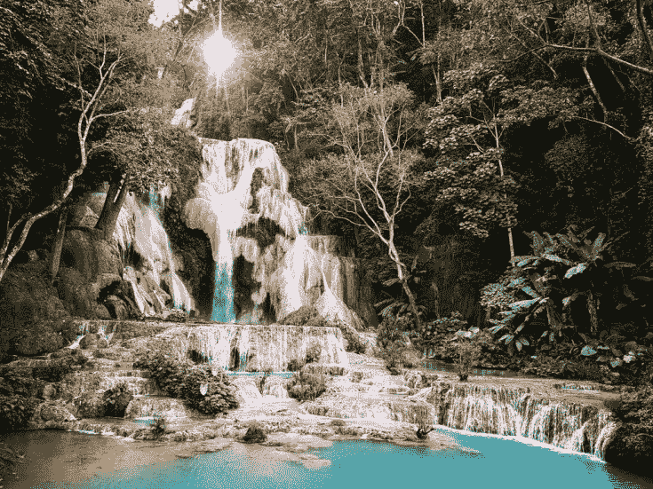

还可以爬到主瀑布的上游，瀑布顶还有很多可以探索的地方。

此外我还去了另一个叫Tat Sae Waterfalls的瀑布，由于是旱季，水很少，不然应该会好很多，不过还是值得一去的，有空的话推荐你去。

市中心有一个叫”Phousi Hill”的小山，很适合看日出日落，推荐在接近6PM的时候去，这样可以避开20K的门票看日落。

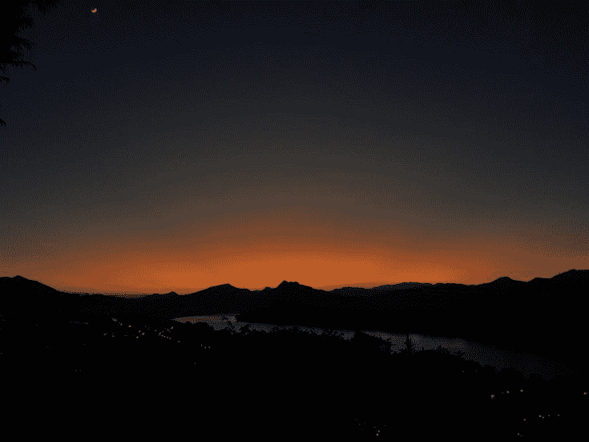

山顶的日落

另一个免费的看日落的好去处是在河边，在谷歌地图上搜索”cross river ferry”就可以。

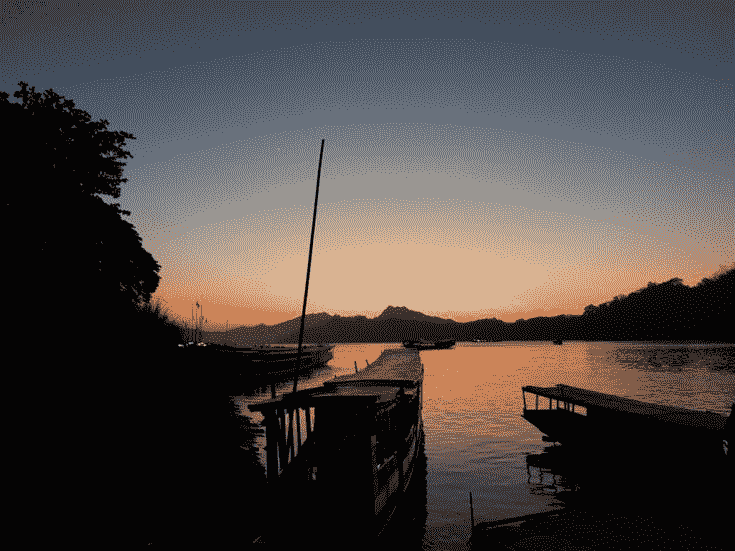

Mekong River的日落

琅勃拉邦适合泡妞的地点推荐：

Night Market（夜市），有很多游客，吃饭、搭讪一举两得。

Utopia Bar：应该是当地游客最多的酒吧了。

**Nong Khiaw**

下一站：Nong Khiaw，在万荣有人推荐我去这里，离Luang Prabang大概3小时车程，路况也不是特别好，有一段在修的路。

这个小镇不大，但是很美，有山有水，很值得到此一游。周围有好几个山，都差不多高，大概不到一个小时就能登顶。我去过的两个山顶分别是Sleeping Woman Viewpoint和Pha Daeng Peak Viewpoint，都不错，很适合看日落，上山的门票为15K。

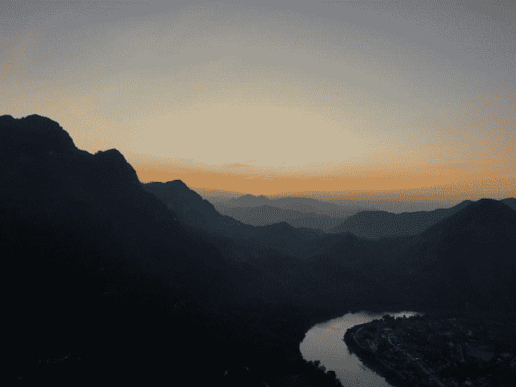

可以住在河边，开门就能看到山水。

<video controls="controls" width="900" height="450"><source src="https://piaohanshenghuo.com/wp-content/uploads/2020/05/2019-12-05-16.30.42.mp4" type="video/mp4"></video>

我下一站本来是向东去Phonsavan看Plain of Jars（8小时车程）。但是收到一个Tinder上的一个常驻Luang Prabang(LPB)的美国美女的消息。我诚实地告诉她我并不住在LPB，但如果她对一段短暂而刺激的浪漫感兴趣的话，我们可以见面。她依然表示感兴趣，这意味着她是DTF(down to fuck)的。所以我决定返回LPB（3小时车程），再从LPB去Phonsavan（6小时的车程），总车程都差不多，还可以额外推倒一个美女，何乐而不为呢？

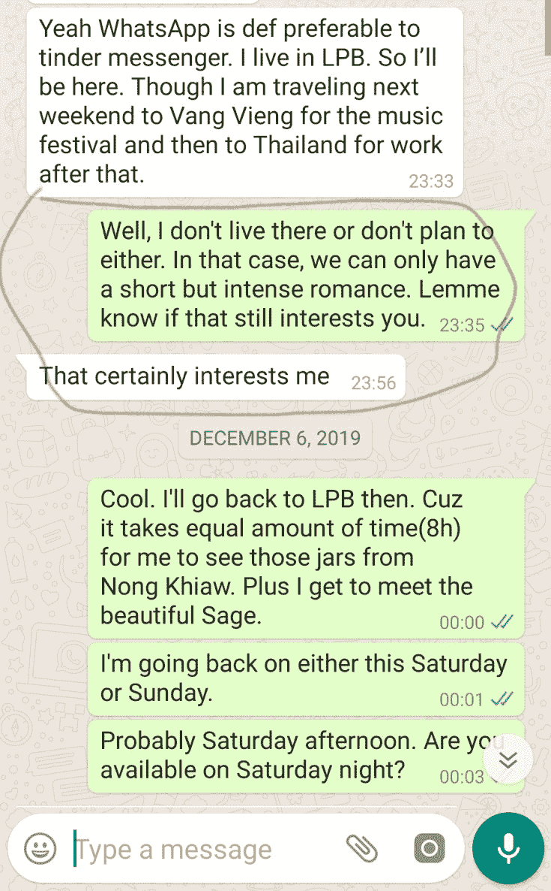

Long story short, 我不出意外地顺利地推倒了那个美国美女。

**Phonsavan**

下一站：Phonsavan，这里唯一值得看的就是Plain of Jars，顾名思义，布满罐子的平原，在这个地方大大小小的石罐子散落一地。没人知道它们的来历，历史上并没有记载，有人说是外星人留下来的。是一个很有神秘感的、神奇的地方。

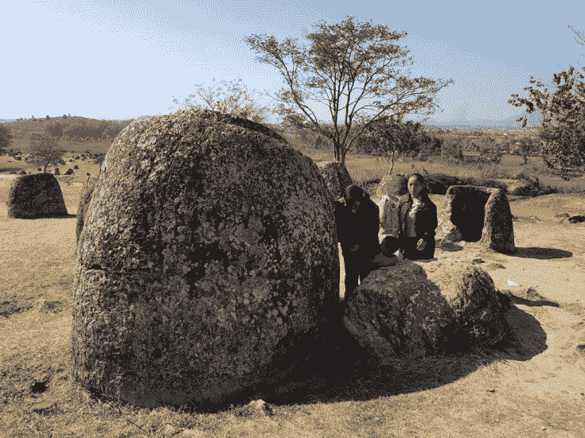

<figcaption class="wp-caption-text">我发现的最大的罐子（比人高）</figcaption>

Plain of Jars有3个不同的地址，都大同小异，去一个足够了。第一个离市中心最近，也最值得一看，因为罐子最多，最大，最“平原”，门票为15K。

另外两个地址离彼此比较近，但离市中心较远，而且并非“平原”，而是“丛林”，罐子分布在树林之间。门票为10K，我去了其中一个，看了下Google Maps上的评论，感觉差不多，另一个虽然很近，我并没有去。

时值12月初，是老挝的冬季，北部是很冷的，晚上的温度已经低到了7摄氏度。

<video controls="controls" width="900" height="450"><source src="https://piaohanshenghuo.com/wp-content/uploads/2020/05/20191209_221733.mp4" type="video/mp4"></video>

推荐这个叫Kong Keo的客栈，便宜又有可以取暖的放在弹壳里的篝火。

**Na Hin(Thakhek Loop)**

下一站是著名的Thakhek Loop上的Na Hin的一个叫Sanhak Guest House的客栈，这段路是我的整个老挝之旅中最艰苦的一段。大概300多公里，谷歌地图推荐的路线大概要6个小时左右的车程（如下图）。但因为这个路线的三分之一我已经在从越南来的路上骑过了，喜欢冒险和新鲜的我选择了东边的山路，以为风景会更好。结果花了我8个多小时，因为其中至少有100公里的坑坑洼洼的土路、山路……路况极差，还好我车胎没坏，不然都没地方修。如果你是自驾游的话，千万不要走这段路！

相信现在谷歌地图推荐的西部的这条路线问题应该不大，因为其中很大一部分都是我刚从越南进入老挝后前往首都万象的路，路况不错。

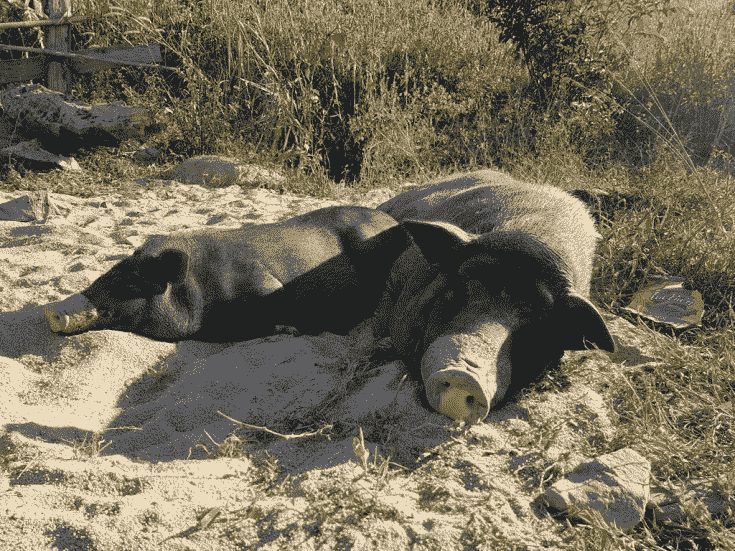

路边的嗮太阳的慵懒又可爱的黑猪。

Thakhek Loop是一个很流行的老挝摩托之旅路线（一个450KM的圈），路况也不错，大部分人在西南方的一个叫Thakhek的城市落脚，租个摩托，骑一圈再回到原点。由于我是从北部来的，第一个落脚地是Na Hin，而且我的时间比较有限（落地签30天就过期），我需要早日赶到南部的大城市Pakse延长我的签证。所以我决定不完成这一整个大圈，而是完成这个大圈中最值得去的地方，以及方便去的地方。

这个最值得去的地方是一个距离我的落脚地40KM的叫”Kong Lor Cave”的山洞，很特别的一个山洞，长达7KM，需要乘船才能通过，山洞的另一边是一个“与世隔绝”的“世外桃源”。

船票是一个人110K（往返），如果是两个人的话可以每人出60K。我一个人去的，也没等碰到其他游客，于是只好自己包下一整条小船。

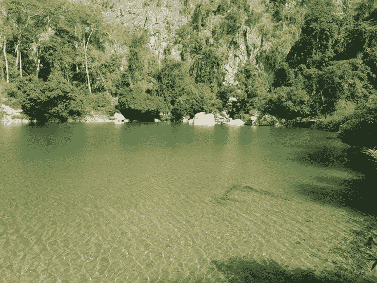

<figcaption class="wp-caption-text">洞口的河水清澈见底，时有鱼群经过</figcaption>

穿上救生衣、戴好头灯后就出发了。船夫熟练地一边操控着细长的小船穿梭于曲折的山洞中，一边用头灯在一片漆黑的山洞中探路，不时还会碰到一两个对面开来的小船，很神奇的经历。

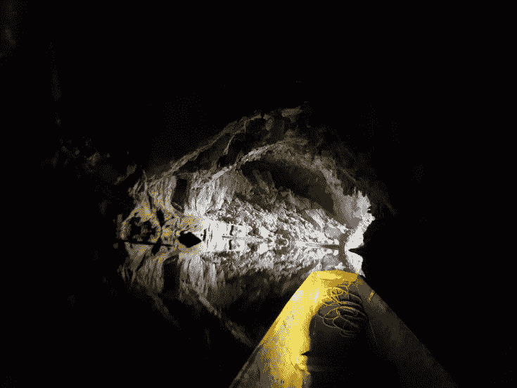

<figcaption class="wp-caption-text">山洞的尽头</figcaption>

山洞尽头的“世外桃源”是一个小村庄，完全没有手机信号，我在村头花20K租了一个很慢的自行车转了一圈儿，没发现什么特别的东西，还差点儿走丢了。

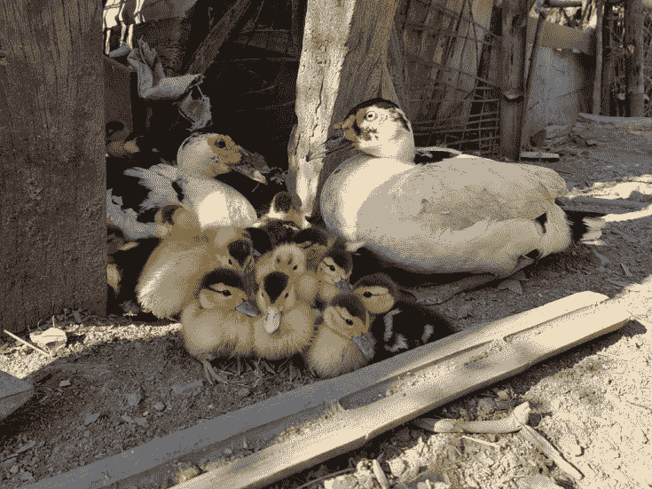

<figcaption class="wp-caption-text">只发现了鹅一家</figcaption>

回到村头后我发现了一家卖当地的手工纺织品的店，给我妈买了个围巾后就原路返回了，不想让船夫多等。（船夫最多等你2小时）

很推荐Kong Lor Cave，给了我前所未有的体验，往返的路况也都很好。

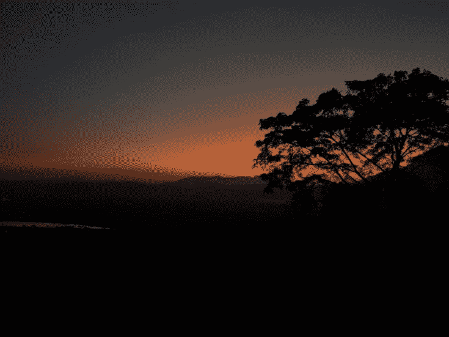

<figcaption class="wp-caption-text">回到Na Hin后看到的夕阳</figcaption>

**Thakhek**

第二天我驱车前往南部的城市Thakhek，迎来的是我整个骑摩托车史上最惨痛的经历，我经历的第一个摩托车交通事故。在我距离Thakhek还有半小时车程的时候，我看到对面远处迎面并排开来两辆大货车，其中一个大货车逆行要超另一个大货车的车，占了基本整个车道。我没当回事儿，因为我们之间距离的很远，我认为到了我们会车的时候，那个大货车肯定已经会跑到另一个车道上边去了，我并没有马上减速，我当时的时速大概在90公里左右。

结果过了漫长的10多秒后，我们即将会车的时候，那个可恶的大货车居然还在我的车道上，我边按喇叭并减速，它丝毫没有避让的意思……只给我留下了路边的很窄的一段路，这段路恰巧还是不稳定的石子路。我失去平衡，摔倒了，“幸运地”没被大货车撞死，而是留下了一些严重的皮外伤。

脚上的伤更严重，摩托车倒地后砸到了我的脚面上，穿透了我的拖鞋，留下了一个不浅的伤口。我赶快用清水处理了一下伤口，把摩托车扶起来，继续骑到了Thakhek。

去的好像是这个小城市的最大的医院，但感觉就是一个简陋的小门诊。不需要会说任何语言，直接给工作人员看我的伤口他们就都明白了，于是我被带到了急诊室，医生给我清理了伤口后，要给我开止痛药和抗生素，我说这些东西都不健康，我不要了，请问处理伤口多少钱。他说处理伤口的成本很低，不需要花钱……我很惊讶，但坚持要给他钱，他说你下次来换纱布的时候给我带瓶啤酒就好了。这个医生很好地体现出了老挝人民淳朴的民风，一点儿都没坑我，我十分感动。我坚持给了他几十K老币后就走了，因为我自己就能换纱布，去药店买原材料就可以。

其实我这里犯了一个错误，像我这种比较深的伤口是应该扎一针破伤风的疫苗的，我忘扎了。不过我多年前因为受伤有扎过，应该会给我一定的抵抗力，总之事过半年之后的今天我还活得好好的。

受伤并没有阻止我旅行的脚步，第二天我就去了附近的山洞，第一个是”Xieng Liap Cave”，离市中心只有15公里，免费，很值得一去。这个洞穴有入口也有出口（大概有将近100米长），中间有水，我受伤的脚显然不能去，不过我依然可以通过一瘸一拐的攀岩的方式体验整个洞穴。洞穴在正中间有一个90度的弯，站在正中间可以勉强同时看到入口和出门。

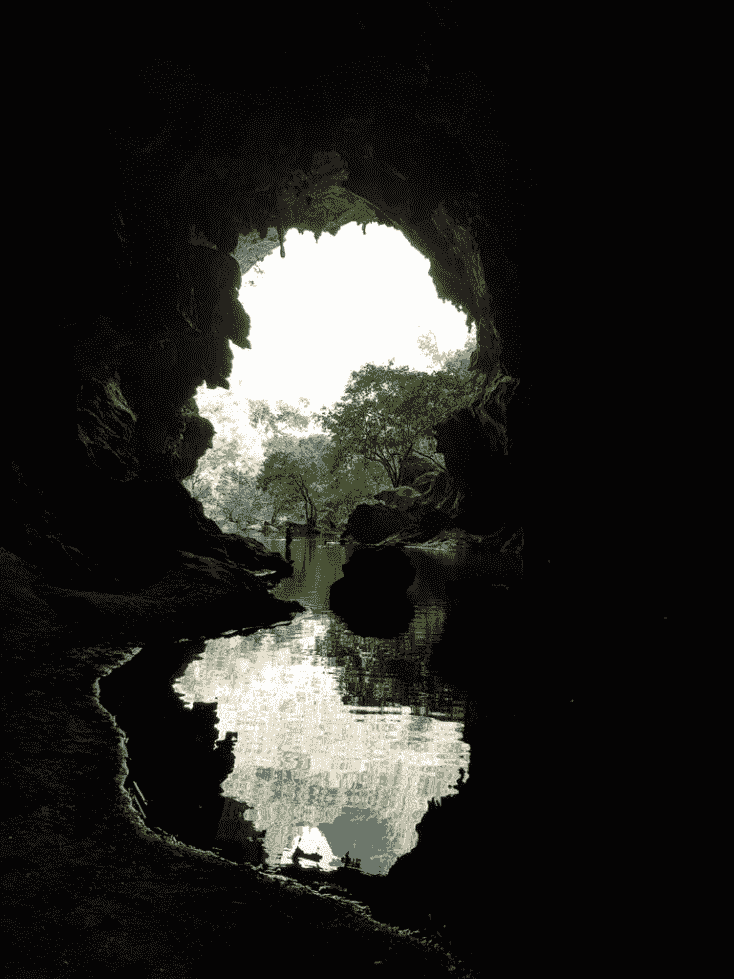

下一个洞穴是”Tham Nang Aen Cave”并不免费，门票是30K，另外最好再买个船票（20K），否则只能看到大概5%的洞穴，船很小，会有一个小伙儿为你荡起单桨，在洞中慢慢前进，大概半小时后会会到达洞穴的另一个出口，得爬上去，很高很大。有时间建议你也去一下，这俩洞穴都离Thakhek不远。

Thakhek本身是一个很小的城市，旅游气息并不是特别浓，在市中心的河边看夕阳很不错。

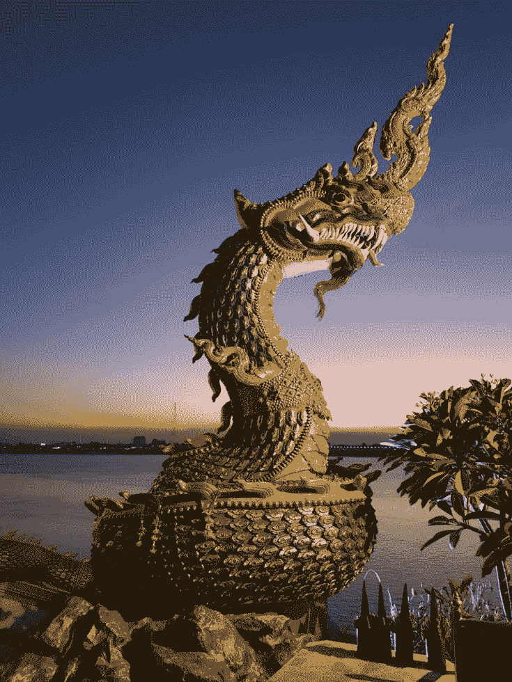

<figcaption class="wp-caption-text">河边夕阳下的雕像</figcaption>

**Pakse**

下一站是Pakse，是一个比较大的城市，西邻泰国，在这里可以延长老挝签证，多延长一天要20K加30K手续费，我延长了13天，交了290K。

我在这里第一次在老挝看到乞讨的孩子，而且有很多。有一个我经常去吃烧烤的夜市，我每次去都会有应该是上小学年纪的小孩儿过来乞讨，我不给钱，但是给吃的。

<figcaption class="wp-caption-text">这里不但有可怜的小孩儿，还有可怜的流浪狗，不少都得了皮肤病，可怜巴巴地等我喂它们。</figcaption>

Pakse最流行的路线叫”Bolaven Plateau Loop”，也是一个大圈（如下图），有很多瀑布。这有个大圈都属于在“高原”，海拔都比西边的Pakse要高，我听说这个圈上很多地方网络都不好，我每天都需要在网上工作。于是我决定以Pakse为基地，每天花半天的时间看一些圈上的景色。右半圈离Paske有点儿太远了，不适合我当天往返，所以我只完成了左边的小圈。如果你有空的话，我强烈建议你完成大圈，因为我完成的小圈上就有很多美景，估计大圈的美景更多。

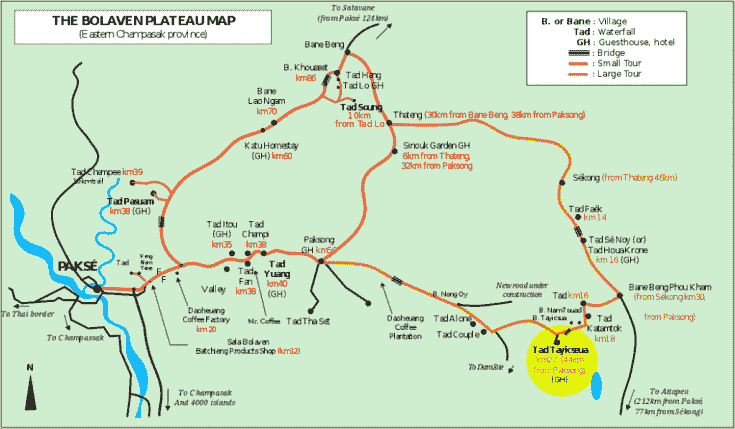

推荐景点：E-TU Waterfall, Tad Champee Waterfall, Tad Fane Waterfall, Tad Yuang Water（这四个瀑布之间的距离都在几公里之内，很方便一起参观），Pha Suam Waterfall。所有的瀑布的门票都很便宜，有的10K，有的15K（合人民币10元左右）。

Tad Champee Waterfall（如下图）: 很适合在瀑布下游泳，瀑布下有很大的一个天然泳池，泳池附近有一些小竹屋供游客休息，在这里待一下午会很惬意。

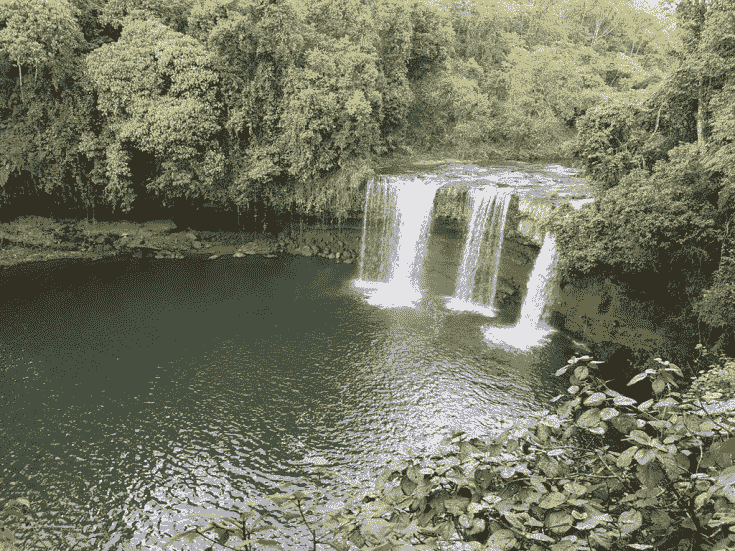

Tad Yuang Waterfall（如下图）：这个瀑布其实比这个图看起来高大多了，有好几十米高，因为我离相机很近，瀑布才显得很矮小。

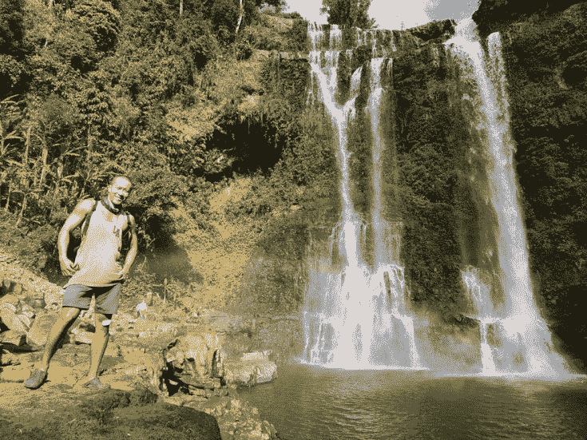

Tad Fane Waterfall（如下图）：附近最高的瀑布，有一百多米高。下图的拍摄地为”Tad Fane Resort”，住在靠瀑布那边的房间的话开窗就可以看到瀑布。在这里还可以玩zip line，不过挺贵的，好像要70美元。

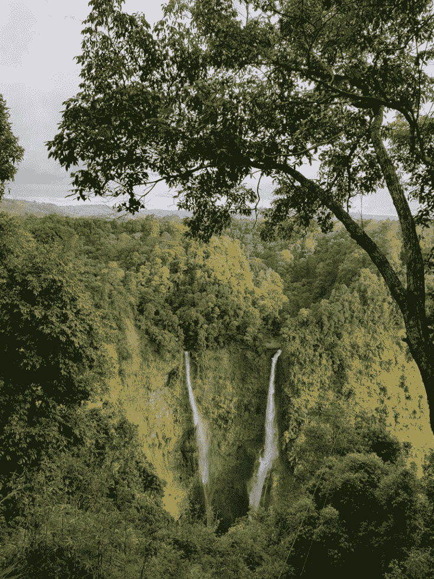

Pha Suam Waterfall（如下图）：这个瀑布的岩石很特别，而且可以买鱼食喂瀑布下游的鱼。

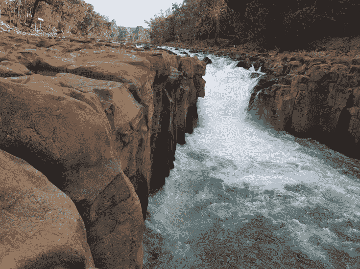

除了普遍，我还推荐Pakse市内河对面山上的大佛（**Wat Phousalao**），很适合在那里看夕阳，这里可以鸟瞰整个城市，可以爬山，也可以直接开车到山顶，很方便。

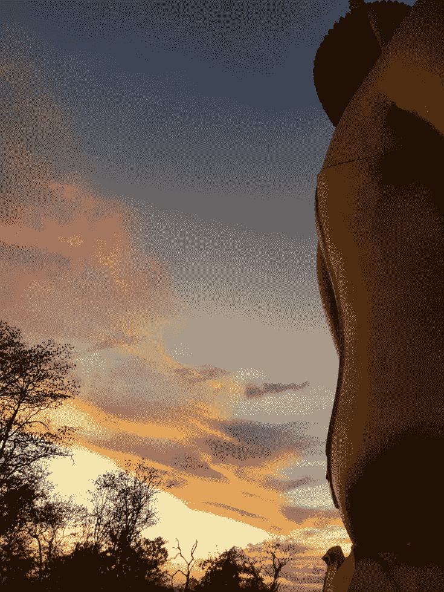

<figcaption class="wp-caption-text">大佛屁股后边的云彩</figcaption>

推荐离市中心40多公里的**Wat Phu**（用谷歌地图推荐的路线都不用买门票，直接在终点翻过一个很矮的门就可以进入了）。很推荐这个庙，我一般对庙并不感冒，但这个庙挺特别的，风格和柬埔寨的很多庙类似，建在山脚下，依山向上建造，向上的阶梯两边对称地种着不知名的一种树，开花后很漂亮，和自然结合得很好，在山顶的视野非常好。

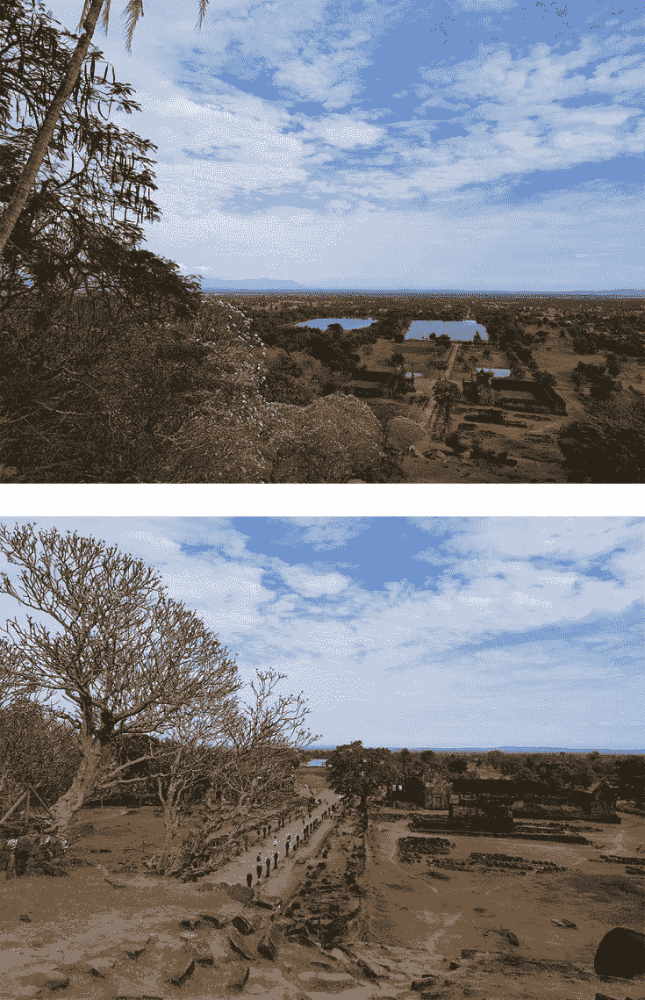

**4000 Islands (Si Phan Don)（四千美岛）**

下一站：4000 Islands，从Pakse开过来一路路况不错，很顺利，这里也是我在老挝的最后一站，在老挝的最南边，离柬埔寨的边境很近。无论是从柬埔寨去老挝的还是从老挝去柬埔寨的游客的必经之地。Mekong River（湄公河）在这里冲刷出了很多个小岛，估计有4000个左右吧，所以才叫”4000 Islands”。

这里最有名的一个岛叫做”Don Det”，也是我第一个目的地，我和我的摩托一起坐了一个由两个小船拼在一起的一个运货的船才过去。

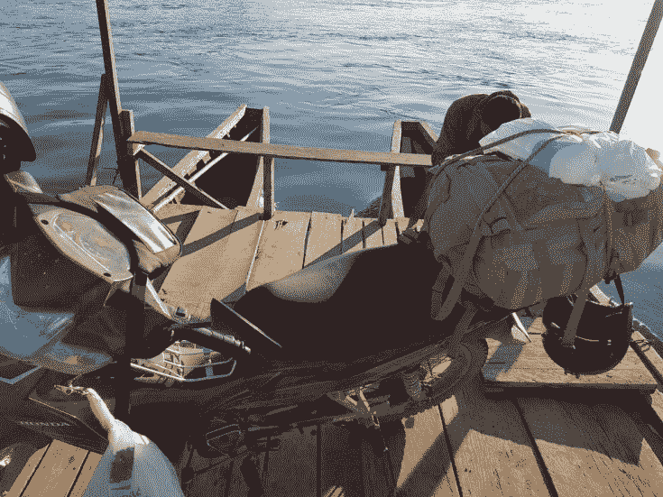

岛上基本都是欧美的游客，岛并不大，有个自行车其实就够了。岛上的夜生活让我失望，游客数量不够多，也不够集中，并不是很适合泡妞（老挝最适合泡妞的地方是万荣(Vang Vieng)）。至少12月的时候是这样的，也许旺季会比较好，有一定潜力。

需要注意的是岛上没有ATM，去之前一定要准备好足够的老币现金，否则岛上的汇率非常糟糕。

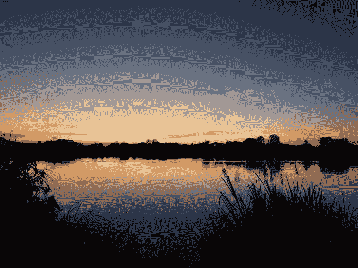

<figcaption class="wp-caption-text">岛上很适合看夕阳。</figcaption>

另外，值得一提的是这个岛上有一个“偷渡”摩托车的生意。因为老挝柬埔寨唯一的边境是个恶名昭彰的坑人的边境，外国人骑的越南的摩托车经常被拒绝入境，然后会有一个人神奇地出现，以极低的价格要买你的摩托。我为这件事已经发愁很久了，后来在岛上打听到了一个“偷渡”的生意，80美元的价格，会有人用船把你的摩托“偷渡”到柬埔寨那边，等你签证下来，入境柬埔寨后在一个人家的后院就可以和你心爱的摩托车重逢了。

我在纠结要不要把我的摩托“偷渡”到柬埔寨，80美元的价格还是可以接受的。后来我想办法，和柬埔寨的贪官斗智斗勇，免费骑摩托从老挝入境柬埔寨（当然花了签证费，但没额外为摩托付款），这个故事可以看我写的另一篇文章[《如何骑摩托从老挝去柬埔寨（我和边境贪官斗智斗勇的故事）》](https://piaohanshenghuo.com/laos-cambodia-border-troubles/)。

Don Det通过一座桥连着另一个叫“Don Khon”的岛，有两个景点，没什么特别的，不非得去。一个叫”Khongyai Beach”，是个“沙滩”，阳光暴晒的沙子很烫。另一个叫”Li Phi Falls”，是个瀑布，门票“很贵”，要35K，个人认为不值得。我之前去的瀑布普遍只要10K或15K的门票。如果你有空，建议你骑到岛的最南端，免费，在那里你可以看到河对岸的柬埔寨。

4000 Islands的最著名的景点是”Khon Phapheng Falls”，世界上水流量最大的也是最宽的瀑布（有10公里！），当年欧洲人刚开船来的时候就卡在这里了。

可以直接在Don Det那个岛上订船去（大部分人的选择），也可以直接在陆地上开车去，我选择的是后者。我在4000 Islands上最大的一个岛(Don Khong)落脚，那里有桥连通陆地。这样我不但可以去看瀑布，还可以为我骑摩托进柬埔寨的计划做准备。

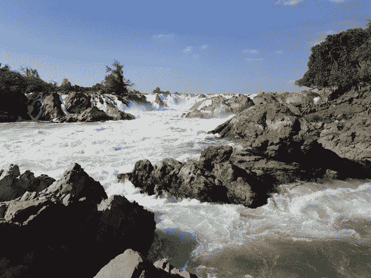

Khon Phapheng Falls很壮观，因为太宽，没有任何照片可以完整地显示出瀑布的全貌。

历时40天的老挝之旅基本结束了，至于我是如何和边境的贪官斗智斗勇，成功从老挝骑摩托进柬埔寨的，敬请期待下一篇文章。

最后再加一张我在Don Khong发现的一只倔强的山羊的照片，很酷的犄角。

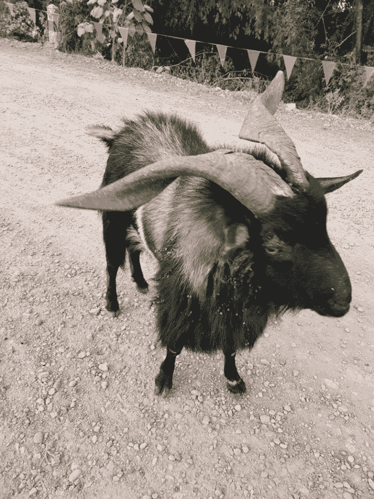

**熬夜码字不易，欢迎以打赏、分享、转发、点页面右下角的“在看”和“点赞”等方式以示支持。**

**另外，还可以点击公众号文章底部的广告来支持我（每个成功的点击量可以帮我赚几毛钱）**。

**谢谢！**

* * *

剽悍生活UL(微信公众号)帮你从**健康、两性关系、生活方式**三个方面全面提高自己，打造理想的生活（尤其是性生活）。

剽悍生活的个人微信号：ycf3721，一对一视频教学，或拉你进入剽悍生活泡妞讨论群。

**长按下图扫码关注公众号**

