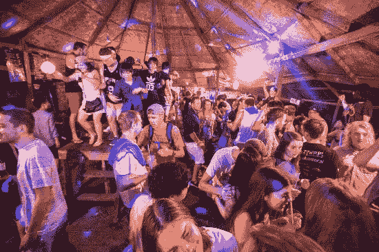
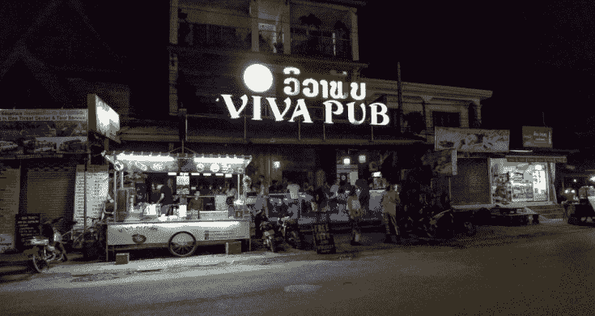
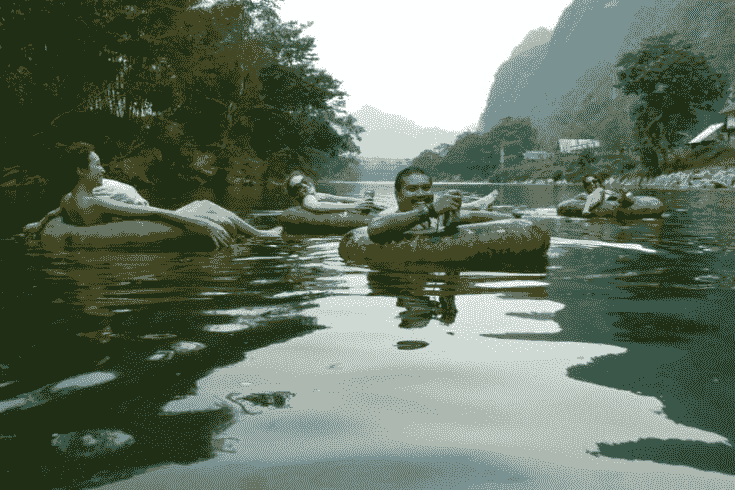
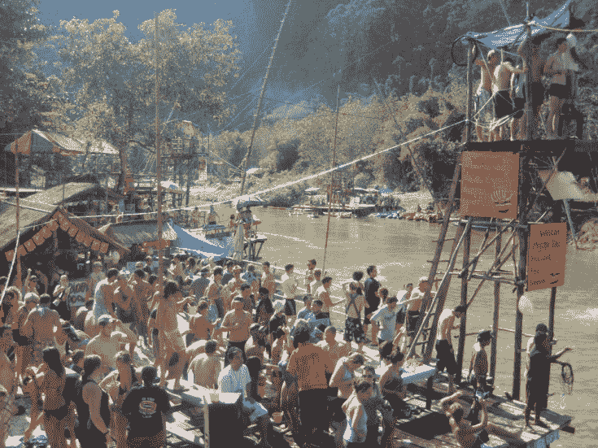

# 老挝万荣(Vang Vieng)夜生活泡妞攻略

> 原文：[https://piaohanshenghuo.com/vang-vieng-nightlife-guide/](https://piaohanshenghuo.com/vang-vieng-nightlife-guide/)

Vang Vieng（万荣）应该是老挝游客（洋妞）最集中的地点了，我在这里住了一周，在这里分享一些经验给大家。

首先，万荣最火的party hostel是**Nana Backpacker** **Hostel**，而且这里还有单间可以住，比一般的单间会更贵一点儿，要18万老币（将近150块钱人民币）。我本来打算在这里入住，但当天房间都满了，我就去了别的地方。后来找了一个性价比很高的民宅，打算把更多精力放在工作上，就没在那里住。但是那个地方绝对是最适合泡妞的住宿地点。有大量美女在这里住，每天晚上都有party，那里还有个泳池。

其次推荐住**Chillao**（很聪明的名字，谐音chill out，结尾又和Laos的读音一样），应该是第二大的party hostel。我也是差点就入住（这里也有单间可以入住），但当时没有合适的房间。也是每天晚上都有party。我在这个青旅门口成功搭讪了一个加拿大美女，并在2个小时内把她带到了我的床上。

建议晚上11点前来上述的两个青旅party。

在旅行的过程中，如果你想泡妞，**我强烈建议入住有单间的青旅**，这样你不但可以方便地在青旅遇到大量美女，还可以方便地把她们带回你的房间。

万荣人流量最大的夜生活地点是一个叫**Sakura Bar**的酒吧/夜店，这里人虽然多，但是绝大部分都是亚洲人，尤其是韩国人（在万荣的韩国游客特别多），12点关门。

12点后，只有一个地方可去，那就是不远处的**Viva Pub**，这里洋妞居多，还有几个也许是本地或者泰国的人妖。

另外，每周五晚上12点后会有一个**jungle party**，可以直接在Sakura Bar或者Viva Pub买门票（3万老币，在jungle party门口买票的话要4万老币），然后会有车直接给你从这两家酒吧的门口送到几公里外的jungle party的地点，回程的车费你要自己出。我是自己骑摩托过去的，又自己一个人骑车回去的（没泡到妞）。不过还是很推荐这个party，这里很容易会有很多美女，参加party的人基本都是欧美的。

另外，白天美女最多的party活动是**tubing**，在你的旅馆就可以订（最好是去一个青旅订，这样可以遇到大部分年轻的背包客），大概5万老币，会有车接送，给你送到河边，再给你一个很大的充满气的汽车内胎，让你可以从河的上游一路飘到下游。这个活动曾经是全万荣，乃至全老挝最火的活动。在河两岸有好几十个酒吧，各种滑梯和跳台等等，非常爽。

但是经常有人喝多、溺水而死，一年能死20多人，后来政府整顿了这个项目，目前河边每天只有3个酒吧了，也没有过去那些巨型滑梯之类的很酷的东西了，规模也小了很多，但还是一个来万荣必玩的项目。

​

另外需要注意的是老挝的文化很保守，非常反对老挝的女人婚前发生性行为，**和老挝的女人发生婚前性行为属于违法行为**，​所以不建议你泡老挝本地的妞。​

关于在万荣泡妞的好去处大概就是这些，万荣是我在老挝最喜欢的地方之一，很推荐你去。

**熬夜码字不易，欢迎以打赏、分享、转发、点页面右下角的“在看”和“点赞”等方式以示支持。**

**另外，还可以点击公众号文章底部的广告来支持我（每个成功的点击量可以帮我赚几毛钱）**。

**谢谢！**

* * *

剽悍生活UL(微信公众号)帮你从**健康、两性关系、生活方式**三个方面全面提高自己，打造更理想的生活（尤其是性生活）。

官网：www.piaohanshenghuo.com

**可以在官网的搜索框里直接搜索你感兴趣的内容**。

剽悍生活的个人微信号：ycf3721，[一对一视频教学](https://www.piaohanshenghuo.com/1on1_coaching/)，或拉你进入[剽悍生活泡妞讨论群](https://piaohanshenghuo.com/ul-group-chat/)，请注明加我的目的。

**长按下图扫码关注公众号**

