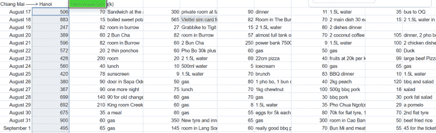

# 越南的物价，我在越南的费用总结

> 原文：[https://piaohanshenghuo.com/cost-of-living-in-vietnam/](https://piaohanshenghuo.com/cost-of-living-in-vietnam/)

本文写的是2019年末越南的物价，仅供参考。

我在越南的前34天（半旅游半工作）花了19290K越南盾（约6000千人民币，1人民币约等于3.3K越南盾），主要花在了住宿和食物上。

接下来讲一下比较有代表性的、必要的费用。

我在河内的机场降落，饿了，在机场买了个三明治花了70K（约20块钱人民币），到市中心的公交车要35K，当晚入住的单间是300K（越南首都的比较便宜的单间），吃了顿丰盛的晚餐，花了我90K。

第二天我去办sim卡，我用的是VIETTEL的一个流量套餐，90K一个月，每天可以用2GB的流量。但是卡本身要250K（我估计是那个柜员坑我，但是我不想浪费时间，就花了这个钱）。

因为第一天的单间的网络并不好，而且价格也不好。第二天我找到了一个便宜的青旅（名叫The Burrow），只要82K（合人民币才20多块钱），而且我找到了一个楼顶的特殊的2人间，我幸运地在这里独自享用了这个单间大概一周的时间，省了不少房租。

这个青旅在一个隐秘的小巷里，这个小巷的路口有一个非常火的路边摊，有我最喜欢的越南菜——Bun Cha。价格也非常好，只要30K一份，还不到10块钱人民币。买两份的话就能吃撑到。

第三天我去买摩托车，用GRAB打了个摩的（越南乃至东南亚的最方便、不会被骗的打的APP）去买车地点，花了27K。二手的摩托车花了我700美金，115CC的半自动档的HONDA BLADE，绝对属于贵的。想要便宜的200美金的都有，但是质量完全没有保障。不建议买中国走私进来的那些摩托车，质量很差。我最不想发生的事情之一就是在我骑到鸟不拉屎的大山里的时候摩托车突然坏了。所以多花点钱买个更靠谱的摩托是很值得的，而且到时候还可以卖掉。

加满3L多的油箱只需要70K左右（大概20块人民币）。

摩托车补胎要70K。

常见的平价旅馆单间要200K左右。

我每天吃两顿饭（基本都是本地人吃饭的地方，否则会贵很多），每顿饭大概要60K到100K。

从第35天开始，我在会安(Hoi AN)住了近2个月，我和我妈两个人一共大概花了49111K（合1.4万人民币），食物是最大的开销。

[我租了一整栋房子](https://piaohanshenghuo.com/how-to-rent-a-room-in-hoi-an-vietnam/)，每月房租为10M（合3000人民币）。

会安的旅游气息特别重，靠谱又便宜的针对本地人的餐厅很少，大部分都是比较贵的面对游客的餐厅。我和我妈两个人每顿饭至少要花50块人民币，最多200。

市场的水果基本最少合10块钱一公斤。

据我所知会安并没有便宜的按摩店，最便宜的也要250K一小时，合70元人民币。

需要注意的是，本文并没有包含交通的费用，只有油钱，因为我去哪里都是骑摩托，而且买摩托的钱也没有被包括进去。如果你租摩托或坐车的话肯定还要花更多的钱。

在越南想低成本地生活又想泡妞，最好去人口较多的大城市，比如河内和岘港，便宜的餐厅会有很多。问题是越南大城市的交通实在太差太乱，污染严重，我个人十分讨厌。

如果你想去东南亚低成本地住一段时间，我并不推荐越南，最推荐的就是泰国的清迈，性价比最高，最适合泡妞，而且非常宜居，建议避免每年2到4月，因为这段时间是泰国北部的”burning season”，农民把庄稼都烧了，为来年做准备，这段时间的空气质量很差。

* * *

剽悍生活UL(微信公众号)帮你从**健康、两性关系、生活方式**三个方面全面提高自己，打造更理想的生活（尤其是性生活）。

官网：www.piaohanshenghuo.com

**可以在官网的搜索框里直接搜索你感兴趣的内容**。

剽悍生活的个人微信号：ycf3721，[一对一视频教学](https://www.piaohanshenghuo.com/1on1_coaching/)，或拉你进入[剽悍生活泡妞讨论群](https://piaohanshenghuo.com/ul-group-chat/)，请注明加我的目的。

**长按下图扫码关注公众号**

