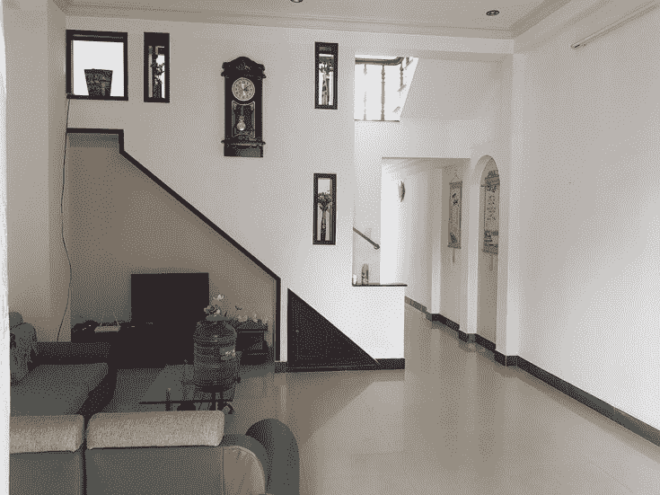
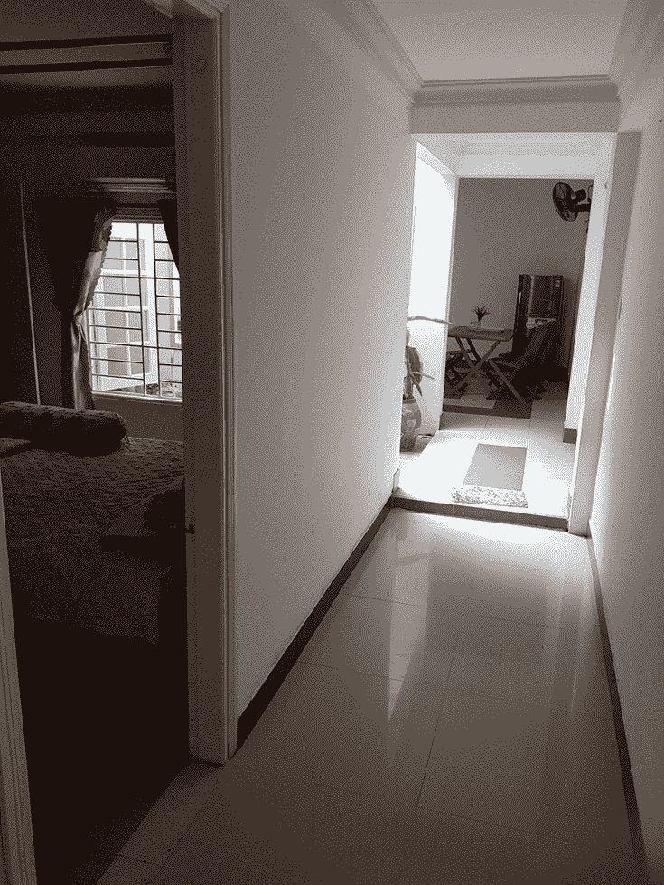
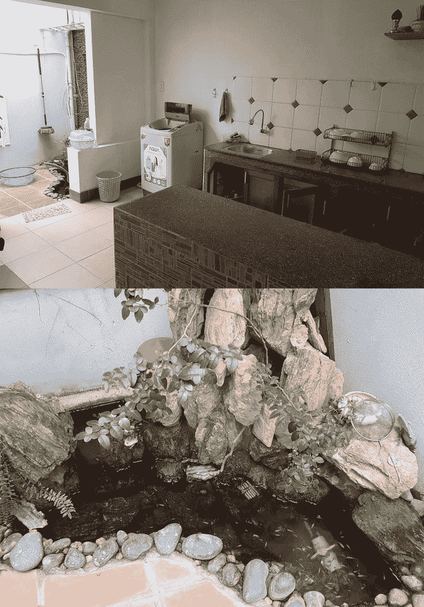
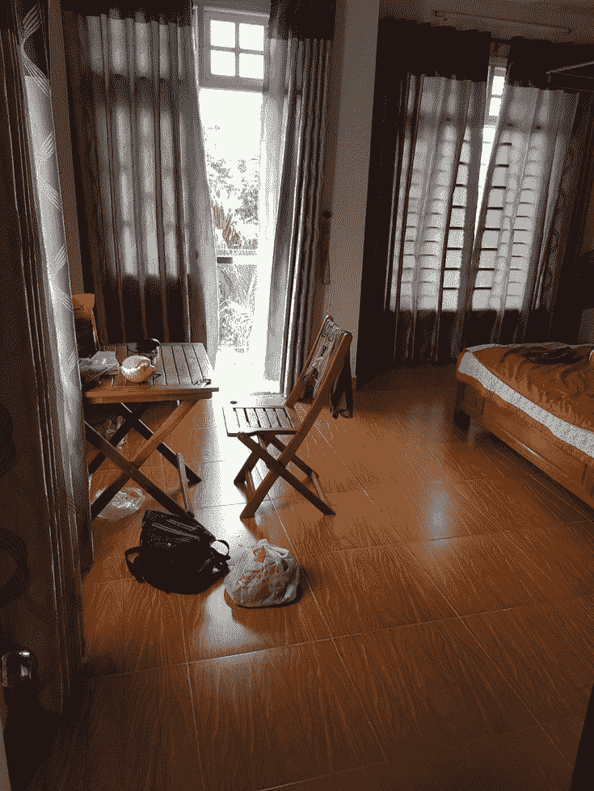
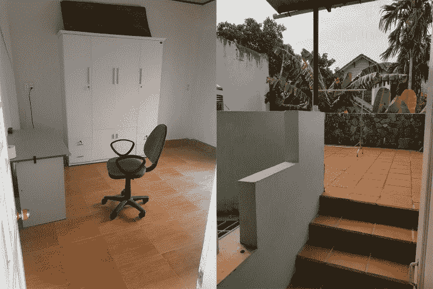
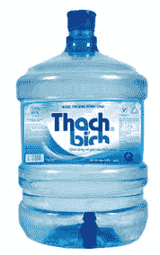

# 我在越南会安住进了1000万的豪宅（附东南亚租房子攻略）

> 原文：[https://piaohanshenghuo.com/how-to-rent-a-room-in-hoi-an-vietnam/](https://piaohanshenghuo.com/how-to-rent-a-room-in-hoi-an-vietnam/)

好久没更新了，一方面是因为我很忙，另一方面更是因为腾讯让我很伤心，无耻地无故在去年12月给我公众号封了。

回到正题，我真的没骗人，我真的在越南会安住进了1000万越南盾（合3000人民币）一个月的别墅，住了2个月。因为我妈要来越南待一段时间，我索性住了一整栋别墅，有两个卧室，一个楼上，一个楼下，不耽误我泡妞。

这是正门进去之后的客厅：

一楼的走廊和卧室：

厨房还有一个小鱼塘：

二楼的主卧和我的办公桌：

二楼还有一个办公室和屋顶：

非常舒适。

饮用水建议你让房主或中介帮你订下图这种大桶水，很便宜，只需要15K越南盾（合5块钱人民币）一桶。

在越南找房子的最简单有效的途径是找一个靠谱的房产中介，建议你在谷歌上做一些调查（比如输入“how to rent a room in Hoi An”），包括谷歌地图，当然你也可以问住在当地的人。我当时是在谷歌上找到的，好几篇文章都推荐同一个房产中介，如果你要在越南会安住一段的话，也推荐你这个中介，名为：Nha Toi Real Estate，在谷歌地图上就能找到，很靠谱。他们不收你钱，而是收房主佣金。

在泰国找房子的最简单有效的途径是结合Renthub租房网站和线下肉身搜索。在泰国非常简单，不需要中介。在Renthub上搜索信息，选定几个候选公寓，再在候选公寓附近骑摩托转一转，看到满意的公寓就直接去前台询问就可以。

另外，**无论你在哪里，都可以通过Facebook Group上搜索本地的租房群、交流群**，上边一般都会有一些租房信息。

检查房子时的检查事项：

淋浴的水压。

防蚊子的纱窗。

水费、电费、上网费。

WIFI（在手机上下载个测网速的软件）

电扇（大部分时间电扇足够，而且更健康）、空调。

另外建议找一个安静的不靠马路的位置。

* * *

剽悍生活UL(微信公众号)帮你从**健康、两性关系、生活方式**三个方面全面提高自己，打造更理想的生活（尤其是性生活）。

官网：www.piaohanshenghuo.com

**可以在官网的搜索框里直接搜索你感兴趣的内容**。

剽悍生活的个人微信号：ycf3721，[一对一视频教学](https://www.piaohanshenghuo.com/1on1_coaching/)，或拉你进入[剽悍生活泡妞讨论群](https://piaohanshenghuo.com/ul-group-chat/)，请注明加我的目的。

**长按下图扫码关注公众号**

